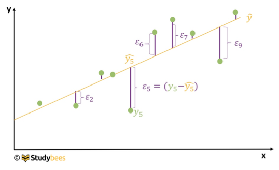
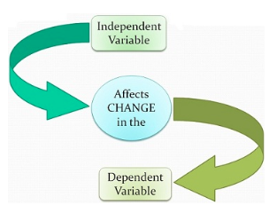

```{r setup, include=FALSE}

## changes made since 1.0:

#daten einlesen 

## laden mit:
# install.packages("learnr")
# learnr::run_tutorial("rMAFK", package = "RfuerMAFKpackage")


#install.packages("remotes")
#remotes::install_github("rstudio/learnr")
library(learnr)
library(foreign)
library(car)
library(psych)
library(esc)
library(gmodels)
library(MASS)

file_path <- system.file("extdata", "Relefant_pre3.sav", package = "RfuerMAFKpackage")
relefant <- read.spss(file_path, to.data.frame = T, use.value.labels = F)

#relefant$Geb <- as.POSIXct(relefant$Geb, origin = "1582-10-14")
#relefant$Geb <- round(abs(difftime(relefant$Geb, as.Date("2017-01-01"), unit = "weeks")/52.25), 2)
#relefant$Geb <- as.numeric(relefant$Geb)
#library(haven)
#write_sav(relefant, "Relefant_pre3.sav")

#relefant <- read.spss ("Relefant_pre3_Lehre.sav", to.data.frame = T, use.value.labels = F)


```

## 1 Willkommen zum Kurs

In diesem Kurs lernst du grundlegende Verfahren der Statistik und deren Umsetzung in R kennen.

### Aufbau

Dieser Kurs gliedert sich in 9 Kapitel:

1.  Willkommen zum Kurs
2.  Skalenniveaus und Datentypen
3.  Daten bearbeiten
4.  Latente Variablen/Skalenbildung
5.  Faktorenanalyse
6.  Inferenzstatistik
7.  Korrelationen
8.  t-Test
9.  Chi-Quadrat

Wir empfehlen, die Kapitel entsprechend der aktuellen Semesterübersicht (Forschungsmethoden 1 und Fortgeschrittenes wissenschaftliches Arbeiten) zu bearbeiten.

### Ablauf

Du bearbeitest diesen Kurses vollkommen selbständig. Im Tutorium kannst du Fragen stellen und Unklarheiten klären.

Links im Menü siehst du die einzelnen Kapitel und Unterkapitel. Jedes Unterkapitel entspricht einer Seite. Wenn du die Seite bearbeitet hast, klickst du unten auf "Next Topic". Du kannst auch im Menü links zischen den Seiten springen, z.B. wenn du eine frühere Lektion wiederholen willst.

Dies ist ein interaktiver Kurs mit Übungen. Dein Fortschritt wird lokal in deinem Browser gespeichert. Wenn du den Kurs das nächste Mal öffnest, wird dir direkt die zu letzt bearbeitete Seite angezeigt. Du kannst einzelne Übungen oder den gesamten Kurs jederzeit neu beginnen, indem du auf "Start over" über der Übung (für diese Übung) oder ganz unten im Menü (für den ganzen Kurs) klickst.

## 1.1 Das Programm R

R ist ein Programm für statistische Datenanalyse und Grafikerstellung.

R ist Open-Source. Die Installation und Anwendung sind kostenlos. Jeder kann zur Weiterentwicklung beitragen, demensprechend gibt es sehr viele Funktionen und R kann für sehr viele Arten von Analysen verwendet werden. Gleichzeitig gibt es eine grosse Community an Nutzer:innen und unzählige Tutorials und Foren im Internet.

R ist eine Programmiersprache. Es gibt keine visuelle Benutzeroberfläche mit "Knöpfen" für einzelne Funktionen (wie z.B. in SPSS), sondern die *Befehle* werden in ein *Skript* geschrieben und dann ausgeführt. So sind die einzelnen Analyseschritte sehr gut nachvollziehbar & reproduzierbar.

```{r quizR, echo = F}
quiz(
  question("Was sind die gennanten Vorteile von R?",
    answer("Es gibt sehr viele Ressourchen (Tutorials, Foren) im Internet.", correct = T),
    answer("R hat eine ausführliche visuelle Benutzeroberfläche."),
    answer("R ist sehr vielseitig.", correct = TRUE),
    answer("Analysen in R sind nicht nachvollziehbar, so merkt keiner wenn ich die Ergebnisse 'geschönt' habe."),
  allow_retry = TRUE
  ))
```

## 1.2 Installation R

Du kannst R auf der [Homepage](https://www.r-project.org) herunterladen:

```{r Download1, echo = FALSE, out.width = "80%", fig.align='center'}

```

Dort wählst du zunächst einen CRAN in deiner Nähe aus, also einen der Links unter Deutschland oder der Schweiz (egal welcher):

```{r Download2, echo = FALSE, out.width = "80%", fig.align='center'}

```

Dann wählst du dein Betriebssystem aus:

```{r Download3, echo = FALSE, out.width = "80%", fig.align='center'}

```

Und dann die richtige Datei (links für Windows, rechts für Mac):

```{r Download4, echo = FALSE, out.width = "49%"}
knitr::include_graphics(c("www/Download4win.png", "www/Download4mac.png", "www/Download5win.png"))
```

Öffne die herunterladene Datei und folge dem Installationsassistenten.

## 1.3 Installation R Studio

R Studio kann als Ergänzung zu R verwendet werden. Da es eine angenehmeres Arbeitsumfeld bietet, wollen wir es verwenden.

R muss auf deinem Computer installiert sein, bevor du R Studio verwenden kannst. Arbeiten werden wir später nur noch in R Studio, welches im Hintergrund auf R zugreift.

[Hier](https://posit.co/download/rstudio-desktop/) kannst du R Studio herunterladen.

Wenn du R und R Studio erfolgreich installiert hast, kannst du mit dem nächsten Kapitel beginnen.

## 1.4 Benutzeroberfläche in R Studio

Beim Öffnen von R Studio siehst du vier rechteckige Bereiche: Skript, Konsole (*Console*), Umfeld (*Environment*) und Ausgabe. Möglicherweise siehst du beim ersten Öffnen noch kein Skript, dann klickst du oben links auf das grüne Plus vor einem weissen Rechteck und wählst "R Script" aus.

```{r Panes, echo = FALSE, out.width = "80%", fig.align='center'}
knitr::include_graphics("www/Panes.png")
```

-   Im **Skript** schreiben wir unsere *Befehle*. Befehle sind Arbeitsanweisungen an R.
-   In der **Konsole** gibt uns R das Ergebnis aus.
-   Im **Umfeld** sehen wir unsere eingelesenen Datensätze. Dieses Fenster werden wir erst später im Kurs verwenden.
-   In der **Ausgabe** sehen wir z.B. Abbildungen. Auch dieses Fenster werden wir erst später im Kurs verwenden.

Zum Beispiel schreibst du im Skript

```{r BeispielSkript, echo = FALSE, out.width = "80%", fig.align='center'}

```

Um den Befehl auszuführen, kannst du entweder oben rechts auf "Run" klicken, oder die Tastenkombination command & enter (mac) bzw. command & r (windows) drücken.

Danach erscheint in der Konsole das Ergebnis

```{r BeispielConsole, echo = FALSE, out.width = "80%", fig.align='center'}

```

Probiere es direkt in R Studio auf deinem Computer aus!

## 1.5 Arithmetische Funktionen

Du hast gerade schon gelernt, dass R als Taschenrechner verwendet werden kann. In dieser Lektion lernst du weitere arithmetische Funktionen in R kennen. Drücke auf "Run Code" um sie auszuführen.

### Addition

```{r addition, exercise=TRUE}
3+7
```

### Subtraktion

```{r subtraktion, exercise=TRUE}
9-5
```

### Multiplikation

```{r multiplikation, exercise=TRUE}
6*2
```

### Division

```{r division, exercise=TRUE}
9/3
```

### Quadrat

```{r quadrat, exercise=TRUE}
2^2
```

### Wurzel

```{r wurzel, exercise=TRUE}
sqrt(9)
```

### Dezimalstellen

Beachte, dass R für Dezimalstellen Punkt statt Komma verwendet. Verwenden wir aus versehen ein Komma statt einen Punkt, erhalten wir eine Fehlermeldung:

```{r decimals, exercise=TRUE}
3,1
```

Korrigiere den Fehler, um keine Fehlermeldung mehr zu erhalten.

### Übung

Multipliziere 23 und 74. Gebe dafür den R Code in das Fenster ein und drücke auf "Run code"

```{r multiplikation2, exercise=TRUE}

```

::: {#multiplikation2-hint}
**Hint:** Verwende das Symbol \* zur Multiplikation
:::

Addiere 3,5 und 1,5

```{r addition2, exercise=TRUE}

```

::: {#addition2-hint}
**Hint:** Verwende das Symbol + zur Addition und verwende Punkt für Dezimalstellen.
:::

Addiere 6 und 4 und teile das Ergebnis durch 3

```{r additiondivision, exercise=TRUE}

```

::: {#additiondivision-hint}
**Hint:** Verwende Klammern um die Addition vor der Division durchzuführen.
:::

Berechne die Wurzel aus der Summe aus 2 und 2

```{r sqrtaddition, exercise=TRUE}

```

::: {#sqrtaddition-hint}
**Hint:** Verwende sqrt() und setze die Summe in Klammern.
:::

## 1.6 Aufbau eines Skipts

Wenn du mehrere Befehle nacheinander durchführen möchtest, kannst du sie untereinander schreiben. Um nur einen Befehl auszuführen setzt du den Cursor hinter den Befehl und drückst dann die Tastenkombination (siehe Unterkapitel Benutzeroberfläche) zum Ausführen oder markierst die Zeile mit der Maus und drückst dann auf "Run Code". Um beide Befehle gleichzeitig auszuführen markierst du beide Zeilen mit der Maus und drückst dann die Tastenkombination oder drückst einfach auf "Run Code".

```{r mehrereZeilen, exercise=TRUE}
5+5
2*5
```

Wenn du also einen neuen Befehls schreibst, musst du den alten nicht löschen. Das wird später noch relevant, wenn wir Analysen mit mehreren Schritten durchführen.

### Kommentare

Kommentare können helfen, das Skript zu strukturieren. Kommentare markierst du mit einer Raute (\#). Alles, was hinter der Raute steht wird von R ignoriert. Zum Beispiel kannst du so eine Erklärung hinzufügen, welche deinen Code nachvollziehbarer macht (für dich zu einem späteren Zeitpunkt oder für andere).

```{r Kommentare, exercise=TRUE}
# Meine ersten Berechnungen in R

# Summe
5+5 # ergibt 10

# Multiplikation
2*5 # ergibt 10
```

In R Studio wird der Kommentar auch in der Konsole angezeigt, aber nicht weiter verarbeitet. Probiere es in R Studio auf deinem Computer aus!

## 1.7 Variablen

Du kannst Zahlenwerte auch einer Variable zuweisen. Dazu verwendst du das Symbol `<-`. Es setzt sich zusammen aus einem Kleiner-Zeichen und einem Minus. Beachte, dass zwischen den beiden Zeichen keine Lücke sein darf. Vor und hinter dem `<-`Symbol ist es allerdings üblich, eine Lücke einzufügen, für eine bessere Lesbarkeit.

```{r skalaredef, exercise=TRUE}
gruppengroesse <- 7
```

Um dir den Wert der Variable anzeigen zu lassen, schreibst du den Variablennamen in eine neue Zeile und führst den Befehl aus:

```{r prepare-gruppengroesse, echo=FALSE}
gruppengroesse <- 7
```

```{r skalareout, exercise=TRUE, exercise.setup = "prepare-gruppengroesse"}
gruppengroesse
```

Mit Variablen kannst du auch rechnen. Zum Beispiel kannst du die Gruppengrösse berechnen, wenn noch zwei Kinder dazugekommen sind:

```{r skalareadd, exercise=TRUE, exercise.setup = "prepare-gruppengroesse"}
gruppengroesse+2
```

Die neue Gruppengrösse wird aber erst dann gespeichert, wenn du sie einer neuen Variable zuweist. Bilde eine neue Variable "gruppengroesse_neu" aus der Summe der alten Gruppengrösse und 2:

```{r skalareaddnew, exercise=TRUE, exercise.setup = "prepare-gruppengroesse"}

```

::: {#skalareaddnew-hint}
**Hint:** Weise der Variable Gruppengrösse_neu den Wert Gruppengrösse+2 zu.
:::

### Variablennamen

> Die Regeln für Variablennamen sind:
>
> -   Variablennamen können Buchtsaben (A-Z; a-z), Zahlen (0-9), Unterstrich (\_) oder Punkt (.) enthalten, sie können aber nur mit Buchstaben oder einem Punkt gefolgt von einem Buchstaben beginnen.
>
> -   Variablennamen unterscheiden zwischen Gross- und Kleinschreibung (Alter und alter sind unterschiedliche Variablen).
>
> -   Reservierte Wörter können nicht als Variablen verwendet werden (TRUE, FALSE, NULL, if...).

> Sinnvolle Variablennamen verweisen auf den Inhalt der Variable, z.B. alter, alterMutter oder alter_mutter oder alter.mutter, Item1, ....

Hier kannst du verschiedene Variablennamen ausprobieren. Ersetze den Variablennamen *alter* mit verschiedenen neuen Varianten. Bei einem unzulässigen Variablennamen erscheint eine Fehlermeldung.

```{r variablenames, exercise=TRUE}
alter <- 5
```

```{r quizVariables, echo = F}
quiz(
  question("Welche Variablennamen sind zulässig (geben keinen Error in R)?",
    answer(".3Item"),
    answer("Item_4", correct = TRUE),
    answer("Geburtstag Vater"),
    answer(".Frage5", correct = TRUE),
  allow_retry = TRUE
  ),
  question("Welche Variablennamen sind sinnvoll?",
    answer("xyz"),
    answer("Variable4"),
    answer("Erstsprache", correct = TRUE),
    answer("sozialeKompetenz_Mittelwert", correct = TRUE),
  allow_retry = TRUE
  )
)
```

## 1.8 Vektoren

Du kannst einer Variable auch mehrere Werte zuweisen, dann bildest du einen Vektor. Dafür verwendest du den Befehl `c()` (combine) und trennst die einzelnen Werte mit Komma.

```{r vektor, exercise=TRUE}
gruppengroesse <- c(9, 7, 10, 12)
```

Stell dir vor du möchtest diese vier Spielgruppen für eine Studie besuchen und jedes Kind soll drei Sticker erhalten. Du kannst jetzt ganz einfach berechnen, wie viele Sticker du pro Gruppe brauchst:

```{r prepare-gruppengroesse2, echo=FALSE}
gruppengroesse <- c(9, 7, 10, 12)
```

```{r vektormulti, exercise=TRUE, exercise.setup = "prepare-gruppengroesse2"}
gruppengroesse*3
```

## 1.9 Dataframes

Für einen besseren Überblick kannst du auch eine Tabelle mit den Namen der Spielgruppen, der Gruppengrösse und der Anzahl der Sticker erstellen. Solche Tabellen heissen in R Dataframes.

Zuerst bildest du die Vektoren "Spielgruppe" und "Gruppengroesse". Beachte, dass du Textelemente in Anführungszeichen setzt. Danach erstellst du einen Dataframe mit dem Befehl data.frame().

```{r df, exercise=TRUE}
# Bilden der Vektoren
Spielgruppe <- c("Marienkäfer", "Sonnenblume", "Bärentatze", "Spatzennest")
Gruppengroesse <- c(9, 7, 10, 12)
# Bilden des Dataframes
df <- data.frame(Spielgruppe, Gruppengroesse)
# Ausgeben des Dataframes
df
```

Du kanns die einzelnen Vektoren ausgeben lassen, indem du das Symbol `$` verwendest.

```{r prepare-df, echo=FALSE}
Spielgruppe <- c("Marienkäfer", "Sonnenblume", "Bärentatze", "Spatzennest")
Gruppengroesse <- c(9, 7, 10, 12)
df <- data.frame(Spielgruppe, Gruppengroesse)
```

```{r dfseecol, exercise=TRUE, exercise.setup = "prepare-df"}
df$Spielgruppe
```

### Neue Spalten (columns)

Mit dem `$`-Zeichen kannst du dem Datensatz auch eine neue Spalte (column) hinzufügen:

```{r dfaddcol, exercise=TRUE, exercise.setup = "prepare-df"}
df$Sticker <- df$Gruppengroesse*3
df
```

### Neue Zeilen (rows)

Du konntest noch eine weitere Spielgruppe für deine Studie gewinnen, das "Schneckenhaus" mit 8 Kindern. Du fügst sie deinem Dataframe hinzu:

```{r prepare-dfsticker}
Spielgruppe <- c("Marienkäfer", "Sonnenblume", "Bärentatze", "Spatzennest")
Gruppengroesse <- c(9, 7, 10, 12)
df <- data.frame(Spielgruppe, Gruppengroesse)
df$Sticker <- df$Gruppengroesse*3
```

```{r dfaddrow, exercise=TRUE , exercise.setup = "prepare-dfsticker"}
df <- rbind(df, list("Schneckenhaus", 8, 8*3))
df
```

## Übung in R Studio

Das wollen wir jetzt in R Studio ausprobieren. Öffne R Studio und führe die Aufgaben dort aus. Du kannst den Text aus dem untenstehenden Fenster kopieren und in dein R Skript einfügen, dann musst du nicht zwischen den Fenstern wechseln. Weil die Aufgaben als Kommentare markiert sind, werden sie nicht ausgeführt.

```{r dfinr, echo = T}
# Aufgabe 1
# Du führst eine Studie in 7 Kitas durch mit 15, 13, 17, 13, 14, 18 und 16 Kindern pro Gruppe. 
#Die Fachpersonen beantworten Fragebögen zum Verhalten der Kinder und erhalten pro Kind 5€ Entschädigung. 
#Erstelle einen Dataframe mit der Anzahl der Kinder und dem zu bezahlenden Betrag.

# Aufgabe 2
# Füge eine weitere Gruppe mit 9 Kindern hinzu.

```

<details>

<summary>**Klicke hier für die Lösung**</summary>

Dies ist eine mögliche Lösung.

```{r code, echo=T}
# Bilden der Vektoren
Gruppengroesse <- c(15, 13, 17, 13, 14, 18, 16)
Betrag <- Gruppengroesse*5
# Bilden des Dataframes
df <- data.frame(Gruppengroesse, Betrag)
# Ausgeben des Dataframes
df

# Hinzufügen der neune Gruppe
df <- rbind(df, list(9, 9*5))
# Ausgeben des Dataframes
df
```

Hinweis: Es gibt verschiedene Möglichkeiten den Dataframe zu bilden. Wichtig ist, dass das Ergebnis stimmt.

</details>

## 2 Skalenniveaus und Datentypen

Das Skalenniveau ist eine wichtige Eigenschaft von Variablen. Wir unterscheiden drei Skalennivaus: *Nominal*, *Ordinal* und *Metrisch*.

-   **Nominale Variablen** sind Kategorien, welche sich nicht in eine sinnvolle Reihenfolge bringen lassen (im Sinne von besser oder schlechter), z.B. Haarfarbe oder Geburtsort.

-   **Ordinale Variablen** können wir zwar in eine Reihenfolge bringen, aber die Abstände zwischen den Kategorien sind nicht gleich gross, z.B. Zufriedenheit auf einer fünfstufigen Skala von *sehr unzufrieden* bis *sehr zufrieden.*

-   **Metrische Variablen** lassen sich in eine Reihenfolge bringen und die Abstände sind definiert, z.B. Alter, Körpergrösse.

```{r quizskalenniveaus, echo = F}
quiz(
  question("Welche Beispiele sind nominal?",
    answer("Körpergewicht"),
    answer("Haarfarbe", correct = TRUE),
    answer("Schulnote"),
    answer("Geburtsort", correct = TRUE),
  allow_retry = TRUE
  ),
  question("Welche Beispiele sind ordinal?",
    answer("Schulnoten", correct = TRUE),
    answer("Geschlecht"),
    answer("Temperatur"),
    answer("Wohlbefinden auf einer Skala von 1 (sehr unwohl) bis 5 (sehr wohl)", correct = TRUE),
  allow_retry = TRUE
  ),
  question("Welche Beispiele sind metrisch?",
    answer("Dauer zum Beenden einer Aufgabe in Sekunden", correct = TRUE),
    answer("Zugehörgkeit zur Interventions- oder Kontrollgruppe"),
    answer("Nationalität"),
    answer("IQ", correct = TRUE),
  allow_retry = TRUE
  )
)
```

## 2.1 Masse der Zentralen Tendenz und Streuung

Das Skalenniveau bestimmt, welche Masse der zentralen Tendenz wir für eine Variable bestimmen können.

-   **Mittelwert** beschreibt den Durchschnitt aller erhobenen Werte. Er wird berechnet mit der Summe aller Werte geteilt durch die Anzahl der Werte. Der Mittwelwert kann nur für metrische Variablen berechnet werden. Bei kleinen Stichproben kann der Mittelwert allerdings durch Extremwerte stark verzerrt werden.

-   **Median** beschreibt den Wert in der Mitte der Verteilung, bei dem die Hälfte der Daten unter und die andere Hälfte der Daten über dem Wert liegt. Er wird bestimmt, indem alle Werte sortiert und dann genau in der Mitte geteilt werden. Der Median kann nur für ordinale oder metrische Variablen berechnet werden.

-   **Modus** beschreibt den am häufigsten vorkommenden Wert. Der Modus kann für alle drei Skalenniveaus bestimmt werden.

Das Skalenniveau bestimmt auch, welche Masse der Streuung wir für eine Variable bestimmen können.

-   **Standardabweichung** beschreibt die durchschnittliche Abweichung vom Mittelwert. Die Standardabweichung kann nur für metrische Variablen berechnet werden.

-   **Spannweite** beschreibt den Abstand zwischen dem kleinsten und grössten Wert. Sie wird berechnet aus der Differenz von Maximum und Minimum. Die Spannweite kann nur für ordinale oder metrische Variablen berechnet werden.

Für nominalskalierte Daten können wir keine Streuungsmaße bestimmen.

```{r quizzentraletendenz, echo = F}
quiz(
  question("Welche Masse kann ich für die Variable Körpergewicht bestimmen?",
    answer("Mittelwert", correct = TRUE),
    answer("Median", correct = TRUE),
    answer("Modus", correct = TRUE),
    answer("Minimum und Maximum", correct = TRUE),
    answer("Standardabweichung", correct = TRUE),
  allow_retry = TRUE
  ),
  question("Welche Masse kann ich für die Variable Haarfarbe bestimmen?",
    answer("Mittelwert"),
    answer("Median"),
    answer("Modus", correct = TRUE),
    answer("Minimum und Maximum"),
    answer("Standardabweichung"),
  allow_retry = TRUE
  ),
  question("Welche Masse kann ich für die Variable Wohlbefinden auf einer Skala von 1 (sehr unwohl) bis 5 (sehr wohl) bestimmen?",
    answer("Mittelwert"),
    answer("Median", correct = TRUE),
    answer("Modus", correct = TRUE),
    answer("Minimum und Maximum", correct = TRUE),
    answer("Standardabweichung"),
  allow_retry = TRUE
  )
)
```

## 2.2 Variablentypen in R

Unser Dataframe zu den Spielgruppen enthält bereits zwei dieser Skalenniveaus. In R sind Variablen mit unterschiedlichen Skalenniveaus als unterschiedliche Variablentypen hinterlegt. Wenn du dir mit dem Befehl `str()` eine Zusammenfassung des Datensatz anzeigen lässt, siehst du diese Variablentypen:

```{r prepare-dfstickerschn}
Spielgruppe <- c("Marienkäfer", "Sonnenblume", "Bärentatze", "Spatzennest")
Gruppengroesse <- c(9, 7, 10, 12)
df <- data.frame(Spielgruppe, Gruppengroesse)
df$Sticker <- df$Gruppengroesse*3
df <- rbind(df, list("Schneckenhaus", 8, 8*3))
```

```{r str, exercise = T, exercise.setup = "prepare-dfstickerschn"}
str(df)
```

Im Output siehst du in der ersten Zeile zunächst die Anzahl der Gruppen (4) und die Anzahl der Variablen (3). Für jede Variable siehst du dann den Variablentyp. Spielgruppe ist `chr` für character, dies entspricht einer nominalen Variable. Gruppengrösse und Sticker sind `num` für numerisch, dies entspricht einer metrischen Variable.

Du kannst auch eine ordinale Variable hinzufügen, z.B. wie freudlich die Spielgruppenleiterin am Telefon war:

```{r factor, exercise = T, exercise.setup = "prepare-dfstickerschn"}
df$Freundlichkeit <- factor(x = c("freundlich", "sehr freundlich", "sehr freundlich", "neutral", "freundlich"),
                         levels = c("unfreundlich", "neutral", "freundlich", "sehr freundlich"),
                         ordered = TRUE)

str(df)
```

Hier sagen wir R, dass es der Variable *Freundlichkeit* im Datensatz *df* die Werte "freundlich", "sehr freundlich", "sehr freundlich", "neutral" und "freundlich" zuordnen soll. Dann sagen wir R unter *levels*, die Reihenfolge der Kategorien und dann unter *ordered*, dass die Werte eine Reiehnfolge haben.

Beachte: du kannst höhere Skalenniveaus immer unter niedrigeren Variablentypen speichern, allerdings kannst du dann nur die Berechnungen durchführen, die mit dem niedriegeren Variablentyp möglich sind.

### Übung

Füge dem Datensatz eine neue ordinale Variable hinzu. Die neue Variable ist die Erreichbarkeit der Spielgruppe. Für die fünf Gruppen ist die Erreichbarkeit: mittel, gut, gut, schlecht, mittel

```{r factornew, exercise = T, exercise.setup = "prepare-dfstickerschn"}

```

::: {#factornew-hint}
**Hint:** Verwende den Befehl `factor()` wie oben und ersetze den Variablennamen und die Ausprägungen.
:::


Prüfe dein Ergebnis mit `str()`.

```{r quizVariabletypes, echo = F}
quiz(
  question("Welchen Variablentyp hat die Variable Erreichbarkeit?",
    answer("chr"),
    answer("num"),
    answer("fct"),
    answer("Ord.factor", correct = TRUE),
  allow_retry = TRUE
  )
)
```

Oft verwenden wir ordinale Variablen als metrische Variablen, weil wir damit besser rechnen können. Z.B. möchten wir den Mittelwert von Schulnoten berechnen oder den Mittelwert eines Fragebogenitems auf einer Skala von 1 (sehr unwohl) bis 5 (sehr wohl). Dann können wir eine Variable umwandeln in numerisch:

```{r prepare-dfstickerschnfreu}
Spielgruppe <- c("Marienkäfer", "Sonnenblume", "Bärentatze", "Spatzennest")
Gruppengroesse <- c(9, 7, 10, 12)
df <- data.frame(Spielgruppe, Gruppengroesse)
df$Sticker <- df$Gruppengroesse*3
df <- rbind(df, list("Schneckenhaus", 8, 8*3))
df$Freundlichkeit <- factor(x = c("freundlich", "sehr freundlich", "sehr freundlich", "neutral", "freundlich"),
                         levels = c("unfreundlich", "neutral", "freundlich", "sehr freundlich"),
                         ordered = TRUE)

```

```{r numeric, exercise = T, exercise.setup = "prepare-dfstickerschnfreu"}
as.numeric(df$Freundlichkeit)
```

Wenn wir möchten, dass diese Variable im Datensatz gespeichert wird, müssen wir sie einer neuen Variable zuweisen. Erstelle eine neue Variable Freundlichkeit_numerisch im Datensatz df:

```{r asnumeric, exercise = T, exercise.setup = "prepare-dfstickerschnfreu"}

```

::: {#asnumeric-hint}
**Hint:** `df$Freundlichkeit_numerisch <- as.numeric(df$Freundlichkeit)`
:::

## 2.3 Daten einlesen

Meistens arbeiten wir in der Forschung mit grösseren Datensätzen, die wir natürlich nicht manuell eingeben wollen wie unseren Spielgruppen-Dataframe. Stattdessen laden wir die Daten z.B. aus unserem Umfragetool herunter und lesen sie in R Studio ein.

In diesem Kurs arbeiten wir mit Daten aus dem ReleFant-Projekt. Dieses Projekt des Lehrstuhl Entwicklung und Bildung in der frühen Kindheit (PH Thurgau/Uni Konstanz) untersucht die Relevanz des Fantasiespiels für die kindliche Entwicklung. Die Daten, die wir verwenden, stammen aus der Vorstudie des Projekts. Bei Interesse kannst du hier den Projektbeschrieb nachlesen: <http://www.phtg.ch/forschung/brueckenprofessuren/projekt-relefant/>

Für die Vorstudie besuchten die Projektmitarbeiterinnen insgesamt 8 Spielgruppen in der Schweiz. Dort führten sie Entwicklungstests mit den Kindern durch und die Spielgruppenleiterinnen beantworteten Fragebögen zu den einzelnen Kindern. In der Hälfte der Spielgruppen fand eine 6-wöchige Intervention zur Fantasiespielförderung statt. In den übrigen Spielgruppen wurde in dieser Zeit der reguläre Spielgruppenalltag fortgeführt. Nach der Intervention wurden die Entwicklungstests und Fragebogenbefragungen wiederholt.

Der Datensatz heisst *Relefant_pre3.sav*, du findest ihn auf Ilias. An der Endung *sav* erkennen wir, dass es sich um eine SPSS-Datei handelt. R selbst (*base R*) hat keinen Befehl, um dieses Dateiformat einzulesen. Es gibt aber ein zusätzliches *Paket*, welches SPSS-Dateien einlesen kann. Pakete sind Erweiterungen, welche zusätzliche Befehle enthalten. Diese müssen vor der Verwendung einmalig installiert werden und nach jedem Neustart des Programms aufgerufen werden.

### Pakete installieren und aufrufen

Zur Insallation des notwendigen Pakets verwedest du den Befehl `install.packages()`und schreibst den Namen des Pakets in Anführungszeichen in die Klammer. Diesen Schritt musst du nur einmal ausführen, danach ist das Paket auf deinem Computer installiert.

```{r, echo=T, eval=F}
install.packages("foreign")
```

Hinweis: Da diese Befehle auf dieser Seite nicht ausgeführt werden können, wirst du sie am Ende dieses Abschnitts direkt in R Studio auf deinem Computer ausprobieren.

Zum Aufrufen des Pakets verwendest du den Befehl `library()`und schreibst den Namen in die Klammer. Diesen Schritt musst du nach jedem Neustart des Programms ausführen, wenn du das Paket verwenden willst.

```{r, echo=T, eval=F}
library(foreign)
```

### Working Directory festlegen

Bevor du nun die Daten einlesen kannst, musst du sie noch auf deinem Computer speichern und R den Speicherort angeben. Lade also die Datei *Relefant_pre3.sav* von Ilias herunter und speichere sie an einem sinnvollen Ort, z.B. einem Ordner *Forschungsmethoden1*. Den Pfad zu diesem Ordner gibst du nun in R an, er heisst dort *Working Directory*. Der Befehl dafür heisst `setwd()`.

Unter Windows öffnest du den Ordner, in welchem die Datei abgelegt ist. Oben in der Navigationsleiste ist nun der Pfad angegeben, allerdings noch im falschen Format mit Pfeilen. Um das richtige Format mit `\` zu erhalten, klicke auf das gelbe Ordner-Symbol links in der Navigationsleiste. Kopiere den vollständigen Dateipfad und füge ihn in Anführungszeichen in den Befehl `setwd()` ein. Nun musst du nur noch die Rückstriche `\` gegen Schrägstriche `/` austauschen.

```{r setwdwindows, echo = FALSE, out.width = "100%", fig.align='center'}

```

Der vollständige Befehl unter Windows sieht dann z.B. so aus:

```{r, eval=FALSE}
setwd("C:/Users/…/Forschungsmethoden1")
```

Unter Mac klickst du mit Rechtsklick auf die Datei und wählst "Informationen". Es öffnet sich ein Fenster und du kannst den unter *Ort* angegebenen Dateipfad direkt in Anführungszeichen in den Befehl `setwd()` einfügen.

```{r setwdmac, echo = FALSE, out.width = "40%", fig.align='center'}

```

Der vollständige Befehl unter Mac sieht dann z.B. so aus:

```{r, eval=FALSE}
setwd("/Users/…/Forschungmethoden1")
```

### Daten einlesen

Zum Einlesen der Daten verwenden wir den Befehl `read.spss()` aus dem Paket `foreign`.

```{r, eval=FALSE}
relefant <- read.spss("Relefant_pre3.sav", to.data.frame = T, use.value.labels = F)
```

> Hier siehst du einen typischen Aufbau eines R-Befehls: Er beginnt immer mit der Bezeichnung des Befehls, hier `read.spss`. In Klammern folgen dann weitere Spezifikationen: das Objekt, für das der Befehl ausgeführt werden soll, hier die Datei *Relefant_pre3.sav*, und Argumente, hier `to.data.frame` und `use.value.labels`. Beide Argumente können wir lediglich ein- oder ausschalten, indem wir sie auf **TRUE** oder **FALSE** setzen (T vs. TRUE bzw. F vs. FALSE sind gleichwertig). Das Ergebnis des Befehls ordnen wir dem Objekt *relefant* zu, damit wir später darauf zurückgreifen können.

Mit diesem Befehl sagen wir R, auf welche Datei es genau zugreifen soll ("Relefant_pre3.sav"), dass es die Datei als Datensatz einlesen soll (to.data.frame = T) und dass wir statt der Wertelabels die Werte einlesen wollen (use.value.labels = F).

So kannst du dir die erten Zeilen des Datensatz anzeigen lassen, um einen Überblick zu bekommen und zu prüfen, ob das Einlesen geklappt hat (Später soll der Datensatz bei dir in R Studio genau so aussehen):

```{r, echo = T}
head(relefant)
```

## Übung in R Studio

Führe die vier Schritte zum Einlesen der Daten in R Studio auf deinem Computer aus.

1.  Installiere das Paket *foreign*.

2.  Lade das Paket *foreign*.

3.  Lade den Datensatz *Relefant_pre3.sav* herunter, speichere ihn auf deinem Computer und lege das *Working Directory* fest.

4.  Lese den Datensatz *Relefant_pre3.sav* ein.

Nach dem Einlesen des Datensatz wird dieser rechts oben im Arbeitsumfeld (*Environment*) angezeigt. Wenn das nicht der Falls ist, prüfe dein Working Directory und versuche es nocheinmal.

Wenn du den Datensatz erfolgreich eingelesen hast, kannst du in R Studio im Environment auf den Namen des Datensatzes klicken, dann wird er dir angezeigt.

Im folgenden Abschnitt werden wir mit diesem Datensatz arbeiten. Du kannst dein Skript speichern und bei der nächsten Übung wieder verwenden, so musst du die Befehle zum Einlesen nicht erneut schreiben. Klicke dafür auf das blaue Diskettensymbol oben links im Skript und speichere das Dokument mit einem sinnvollen Namen an einem sinnvollen Ort ab.

```{r save, echo = FALSE, out.width = "80%", fig.align='center'}

```

## 2.4 Deskriptive Statistik

Die deskriptive Statistik beschreibt empirische Daten mit Masszahlen, Tabellen und Grafiken. Ziel ist es, einen Überblick über die erhobenen Daten zu erhalten. Es ist der erste Schritt der Datenanalyse.

Einige Masszahlen hast du in diesem Kurs bereits kennengelernt. Zur Wiederholung hier ein kleines Quiz. Falls du Schwierigkeiten mit den Fragen hast, gehe zurück zum Kapitel "Skalenniveaus und Datentypen".

```{r quizdescriptives, echo = F}
quiz(
  question("Welches Mass beschreibt den Wert in der Mitte der Verteilung?",
    answer("Mittelwert"),
    answer("Modus"),
    answer("Median", correct = TRUE),
  allow_retry = TRUE
  ),
  question("Was ist die Standardabweichung?",
    answer("Ein Streuungsmass", correct = TRUE),
    answer("Der Abstand zwischen dem kleinsten und grössten Wert."),
    answer("Die durchschnittliche Abweichung vom Mittelwert.", correct = TRUE),
  allow_retry = TRUE
  ),
  question("Für welches Skalenniveau lässt sich die Spannweite bestimmen?",
    answer("Nominal"),
    answer("Ordinal", correct = TRUE),
    answer("Metrisch", correct = TRUE),
  allow_retry = TRUE
  )
)
```

## 2.5 Modus, Tabellen und Balkendiagramme

Die erste Variable im Datensatz *relefant* (nach ID Kind und Gruppe) ist die Zugehörigkeit zur Interventions- vs. Kontrollgruppe. Die Variable heisst *Intervention* und hat zwei Aussprägungen 0 (*Kontrollgruppe*) und 1 (*Interventionsgruppe*). Du kannst dir die Variable anzeigen lassen:

```{r Interventionanzeigen, exercise = T}
relefant$Intervention
```

Passe den Code so an, dass dir die Variable *sex* (Geschlecht) angezeigt wird.

Beide Variablen haben in diesem Datensatz zwei Ausprägungen: 0 oder 1. Es sind **dichotome Variablen**, eine besondere Form von nominalen Variablen.

Du hast bereits gelernt, dass wir für nominale Variablen ausschliesslich den Modus berechnen können. Dafür gibt es keinen Befehl, sondern wir erstellen eine Tabelle:

```{r modus, exercise = T}
table(relefant$Intervention)
```

Wir sehen, es sind 33 Kinder in der Interventionsgruppe und 33 Kinder in der Kontrollgruppe. Da beide Merkmale gleich häufig vorkommen, ist die Variable **bimodal**. Wie ist es beim Geschlecht?

```{r modussex, exercise = T}

```

::: {#modussex-hint}
**Hint:** `table(relefant$sex)`
:::

```{r quiztable, echo = F}
quiz(
  question("Was ist der Modus für Geschlecht?",
    answer("0"),
    answer("1", correct = TRUE),
    answer("bimodal"),
  allow_retry = TRUE
  )
)
```

Du kannst auch eine Tabelle mit der relativen Häufigkeit der Kategorien ausgeben lassen:

```{r proptable, exercise = T}
prop.table(table(relefant$Intervention))
```

> Schreiben wir mehrere Befehle ineinander, bearbeitet R diese von innen nach Aussen. Hier wird also zuerst eine Tabelle erstellt, und dann die Proportionen ausgerechnet.

Wie würde der Befehl für die Variable Geschlecht aussehen?

```{r proptablesex, exercise = T}

```

::: {#proptablesex-hint}
**Hint:** `prop.table(table(relefant$sex))`
:::

### Balkendiagramme

Nun weisst du, wie du den Modus bestimmen kannst. Gleichzeitig hast du gelernt, eine Tabelle zu erstellen. Wir können die Daten aber auch grafisch darstellen, und zwar in einem Balkendiagram.

> Balkendiagramme (manchmal auch Säulendiagram) zeigen die Häufigkeiten von Kategorien an. Sie sind geeignet, um nominale Daten darzustellen. Die Reihenfolge der Balken ist willkürlich.

Um ein Balkendiagram der Variable *Intervention* zu erstellen, greifen wir auf die Tabelle zurück und lassen uns diese mit dem Befahl `barplot()`als Balkendiagramm anzeigen. Dafür gibt es zwei Möglichkeiten:

Wir ordnen die Tabelle einem neuen Objekt zu und führen an diesem Objekt den Befehl `barplot()` aus:

```{r barplot1, exercise = T}
Intervention_tab <- table(relefant$Intervention)
barplot(Intervention_tab)
```

Diese Variante bietet sich dann an, wenn wir später noch weitere Analyseschritte mit dieser Tabelle durchführen wollen. Dann können wir jedes Mal auf das Objekt *Intervention_tab* zurückgreifen.

Oder wir setzen den Befehl `table(relefant$Intervention)` direkt in den Befehl `barplot()`:

```{r barplot2, exercise = T}
barplot(table(relefant$Intervention))
```

Es gibt viele Möglichkeiten, die Abbildung anzupassen, indem wir dem Befehl weitere *Argumente* hinzufügen. Z.B. beschriften wir die Balken mit dem Argument `names.arg`:

```{r barplot3, exercise = T}
barplot(table(relefant$Intervention), names.arg = c("Kontrollgruppe", "Interventionsgruppe"))
```

Diese Argumente musst du nicht auswendig kennen, sondern du kannst sie in der *R Dokumentation* nachlesen. Tippe dafür ein Fragezeichen und den Namen des Befehls ein (Falls die Dokumentation nicht gut lesbar ist, zeige das Fenster in voller Grösse an oder probiere es direkt in R Studio auf deinem Computer):

```{r help, exercise = T}

```

::: {#help-hint}
**Hint:** `?barplot`
:::

Erstelle nun ein Balkendiagram für die Variable "Intervenion" mit blauen Balken (*blue*):

```{r barplotblue, exercise = T}

```

::: {#barplotblue-hint}
**Hint:** `barplot(table(relefant$Intervention), col = "blue")`
:::

Tabellen und Balkendiagramme können für alle Skalenniveaus verwendet werden, allerdings sind sie für nominale und ordinale Variablen am besten geeignet. Für metrische Variablen sind sie wenig übersichtlich, da es sehr viele verschiedene Ausprägungen gibt und eine Ausprägung selten mehrfach vorkommt.

## 2.6 Median, Mittelwert, Histogramme & Boxplots

Eine andere Variable im Datensatz ist *Geb*, das Alter der Kinder. Da die Variable Linear ist, können wir den Median (`median()`) und den Mittelwert (`mean()`) bestimmen, sowie Standardabweichung (`sd()`), Minimum (`min()`) und Maximum (`max()`).

Wir könenn also den Mittelwert bestimmen indem wir schreiben:

```{r meanna, exercise = T}
mean(relefant$Geb)
```

Hier gibt uns R *NA* aus. NA steht für fehlende Werte, d.h. hier hat die Spielgruppenleiterin kein Alter angegeben. R soll aber den Mittelwert bestimmen, ohne die NAs zu berücksichtigen. Dafür verwenden wir das Argument `na.rm`:

```{r meannona, exercise = T}
mean(relefant$Geb, na.rm = TRUE)
```

Berechne auf diese Weise auch den Median, Standardabweichung, Minimum und Maximum:

```{r median, exercise = T}
sd(relefant$Geb, na.rm = TRUE)
```

```{r quizdesc, echo = F}
quiz(
  question("Was ist der Median für Alter?",
    answer("3.44"),
    answer("4.03", correct = TRUE),
    answer("4.51"),
  allow_retry = TRUE
  ),
  question("Was ist die Standardabweichung für Alter?",
    answer("0.3241944", correct = TRUE),
    answer("0.5334286"),
    answer("3.3241944"),
  allow_retry = TRUE
  ),
  question("Was sind Minimum und Maximum für Alter?",
    answer("3.26 und 4.87", correct = TRUE),
    answer("3.26 und 5.34"),
    answer("2.34 und 4.87"),
  allow_retry = TRUE
  )
)
```

Der Befehl `summary()` gibt gleichzeitig Median, Mittelwert, Minimum und Maximum aus. Zusätzlich gibt es auch das 1. und 3. Quartil (*1st Qu.*; *3rd Qu.*) aus. Wie der Median die Daten in der Mitte teilt, teilen die Quartile das untere und obere Viertel der Daten ab. Der Median ist also theoretisch das 2. Quartil.

```{r quartile, echo = FALSE, out.width = "80%", fig.align='center'}

```

```{r desc, exercise = T}
summary(relefant$Geb)
```

### Histogramm

Ein Histogramm zeigt die Häufigkeiten von Ausprägungen einer Variable. Anders als beim Balkendiagramm werden die Daten erst in Gruppen eingeteilt  (z.B. das Alter in Jahres-Blöcke). Die Höhe der Balken eines Historgramms beschreibt die Häufigkeit der Ausprägung; die Breite der Balken eines Histograms beschreibt das Intervall der Gruppen (z.B. 0-11 Monate, 12-23 Monate,...).

Der Befehl `hist()` erstellt ein Histogramm.

```{r hist, exercise = T}
hist(relefant$Geb)
```

R teilt die Daten automatisch in 2-Monats-Blöcke ein. Wir können die Breite der Balken anpassen mit dem Argument `breaks`. Zum Beispiel können wir festlegen, dass wir 4 Balken darstellen möchten.

```{r hist2, exercise = T}
hist(relefant$Geb, breaks = 4, freq = F)
```

```{r quizhist, echo = F}
quiz(
  question("Lass dir die R Dokumentation zum Befehl `hist()` anzeigen. Was beweirkt das Argument `freq = FALSE`?",
    answer("Die Anzahl der Datenpunkte pro Balken wird angezeigt."),
    answer("Statt der absoluten Häufigkeit wird die prozentuale Häufigkeit angezeigt.", correct = TRUE),
    answer("Statt der prozentualen Häufigkeit wird die absolute Häufigkeit angezeigt."),
  allow_retry = TRUE
  )
)
```

### Boxplot

Der Boxplot ist eine übersichtliche Darstellung von Minimum, unteres Quartil, Median, oberes Quartil und Maximum. Minimum und Maximum werden durch die Whisker dargestellt. Wenn aber die Whisker länger sind als das 1,5-fache der Box, werden die Werte ausserhalb dieses Bereichs als Ausreisser (*Outlier*) eingezeichnet.

```{r boxplotabb, echo = FALSE, out.width = "80%", fig.align='center'}

```

Für die Variable Alter kannst du das Boxplot so erstellen:

```{r boxplot, exercise = T}
boxplot(relefant$Geb)
```

Manchmal kann es auch sinnvoll sein, einen gruppierten Boxplot zu erstellen, z.B. aufgeteilt nach Interventions- vs. Kontrollgruppe:

```{r boxplotgrouped, exercise = T}
boxplot(relefant$Geb ~ relefant$Intervention)
```

Erstelle ein gruppiertes Boxplot, welches die Verteilung der Variable *Dauer* (seit wie vielen Wochen besucht das Kind die Spielgruppe) darstellt, aufgetielt nach *GID* (Gruppen-ID):

```{r boxplotgrouped2, exercise = T}

```

::: {#boxplotgrouped2-hint}
**Hint:** `boxplot(relefant$Dauer ~ relefant$GID)`
:::

Vielleicht möchtest du herausfinden, welches Kind hinter einem Ausreisser steht. Leider hat der Befehl `boxplot()`in base R kein Argument dafür. Aber es gibt den Befehl auch im Paket *car*. Um diesen Befehl in R Studio auf deinem Computer zu verwenden, musst du zunächst das Paket *car* installieren. Den Befehl dafür hast du bereits gelernt:

```{r, echo=T, eval= F}
install.packages("car")
```

Danach kannst du das Paket aufrufen:

```{r, echo=T, eval= F}
library(car)
```

Und dann den Befehl verwenden (Achtung, diser Befehl wird gross geschrieben):

```{r, echo=T, eval= F}
Boxplot(relefant$Dauer ~ relefant$GID, id = TRUE)
```

In diesem Boxplot kannst du nun die id (Zeilennummer) der Aussreisser ablesen. Durch Klicken auf den Datensatz im Arbeitsumfelt kannst du dort nachschauen, wie lange die Ausreisser in der Spielgruppe sind.

Öffne dein Skript zum einlesen des Datensatzes in R Studio auf deinem Computer und führe die hier beschriebenen Schritte zum erstellen eines Boxplots mit beschrifteten Ausreissern aus.

```{r quizoutlier, echo = F}
quiz(
  question("Wie lange sind die Aussreisser in der Spielgruppe?",
    answer("18, 74 und 104 Wochen"),
    answer("18, 72, 72 und 104 Wochen", correct = TRUE),
    answer("18, 72, 72 und 102 Wochen"),
  allow_retry = TRUE
  )
)
```

## 3 Daten bearbeiten

Nach der Datenerhebung, aber vor der Datenanalyse, kann es notwenig sein, die Daten zu bearbeiten. Mögliche Schritte, welche du hier kennenlernen wirst, sind:

-   Filtern

-   Neucodieren

## 3.1 Filtern

Manchmal möchten wir einen Teildatensatz erstellen, der nur bestimmte Variablen enthält. Dafür verwenden wir den Befehl `subset()`. Wenn wir z.B. nur die Varibalen *Intervention*, *sex* und *Geb* behalten wollen, lautet der Befehl:

```{r subset1, exercise = T}
relefant_sub <- subset(relefant, select = c(Intervention, sex, Geb))
```

Mit dem Befehl `str()` können wir prüfen, ob das Erstellen des Teildatensatzes geklappt hat:

```{r prepare-subset2, echo=FALSE}
relefant_sub <- subset(relefant, select = c(Intervention, sex, Geb))
```

```{r subset2, exercise = T, exercise.setup = "prepare-subset2"}
str(relefant_sub)
```

Wenn wir viele Spalten filtern wollen, kann es praktisch sein statt der einzelnen Spaltennamen ganze Bereiche anzugeben. Mit `Intervention:Dauer` können wir den Bereich von Variable Intervention bis Variable Dauer auswählen, mit `1:5` die Spaltennummern eins bis fünf.

Wähle die Spalten *KID* bis *Deutsch1* aus, einmal mit Variablennamen, einmal mit Spaltennummern:

```{r subset3, exercise = T}
relefant_sub <- subset(relefant, select = c(1:5))
```

::: {#subset3-hint}
**Hint:** `Relefant_sub <- subset(relefant, select = c(KID:Deutsch1))` `Relefant_sub <- subset(relefant, select = c(1:6))` **Tipp**: Mit `head(relefant)` kannst du dir den Datensatz anzeigen lassen, um die Spaltennummern abzuzählen.
:::

Wir können auch nach Zeilen Filtern, z.B. alle Kinder in der Kontrollgruppe, alle Kinder die Älter als 5 Jahre sind usw.

Die *Bedingung* für das Filtern legen wir mit Operatoren fest:

| Operator | Bedeutung           |
|----------|---------------------|
| `==`     | gleich              |
| `<`      | kleiner             |
| `<=`     | kleiner oder gleich |
| `>`      | grösser             |
| `>=`     | grösser oder gleich |
| `!=`     | nicht gleich        |

Diese setzen wir so ein:

```{r subrow, exercise = T}
relefant_kont <- subset(relefant, Intervention == 0)
```

Um zu überprüfen, ob das Filitern geklappt hat, lassen wir uns die Anzahl der Fälle anzeigen:

```{r prepare-nrow, echo=FALSE}
relefant_kont <- subset(relefant, Intervention == 0)
```

```{r nrow, exercise = T, exercise.setup = "prepare-nrow"}
nrow(relefant_kont)
```

Die Anzahl der Fälle im neuen Datensatz entspricht der Anzahl der Kinder in der Kontrollgruppe, wie wir sie für die deskriptiven Daten bestimmt haben. Das Filtern hat also geklappt.

### Übung

Erstelle einen Teildatensatz mit allen Kindern älter als 5 Jahre:

```{r subrow2, exercise = T}

```

<div>

**Hint:** `relefant_kont <- subset(relefant, Geb > 5)`

</div>

Erstelle einen Teildatensatz mit allen Kindern, deren Alter nicht missing ist.

```{r subrow3, exercise = T}

```

<div>

**Hint:** `relefant_kont <- subset(relefant, Geb != NA)`

</div>

## 3.2 Filtern mit mehreren Bedingungen

Manchmal wollen wir mehrere Bedingungen gelichzeitig setzen.

Zum Beispiel wollen wir nur die Kinder anschauen, die Älter sind als 4 Jahre und in der Kontrollgruppe sind. Dann verbinden wir die Bedingungen mit ´&´:

```{r subrow4, exercise = T}
relefant_ue4_kon <- subset(relefant, Geb > 4 & Intervention == 0)
nrow(relefant_ue4_kon)
```

Oder wir wollen nur die Kinder anschauen, die entweder keine Schwierigkeiten haben Deutsch zu verstehen (*Deutsch2*) oder zu sprechen (*Deutsch3*). Dann verbinden wir die Bedingungen mit ´\|´:

```{r subrow5, exercise = T}
relefant_deu <- subset(relefant, Deutsch2 == 0 | Deutsch3 == 0)
nrow(relefant_deu)
```

Und schliesslich können wir auch für so einen Teildatensatz nur bestimmte Variablen auswählen, indem wir das Argument zum Filtern der Variablen einfügen:

```{r subrow6, exercise = T}
relefant_deu <- subset(relefant, Deutsch2 == 0 | Deutsch3 == 0, select = c(Deutsch2, Deutsch3))
head(relefant_deu)
```

## 3.3 Neucodieren

In Fragebögen werden oft *Skalen* mit mehreren *Items* verwendet. Manche dieser Items sind *invers*, also umgekehrt kodiert. Z.B. bei einer Skala für Wohlbefinden bedeutet höhere Zustimmung höheres Wohlbedfinden, ausser beim Item "ich fühle mich oft niedergeschlagen". Dieses Item ist invers kodiert und muss neu kodiert werden.

Dafür verwenden wir den Befehl `recode()` aus dem Paket `car`. Dieses Paket haben wir bereits vorher verwendet, deshalb musst du es nur aufrufen, wenn du den Befehl verwenden willst.

```{r quizlibrary, echo = F}
quiz(
  question("Wie lautet der Befehl, um das Paket car aufzurufen?",
    answer("install.packages('car')"),
    answer("update.packages(car)"),
    answer("library(car)", correct = T),
    answer("car <- library()"),
  allow_retry = TRUE
  )
  )
```

Wenn wir die Variable *Deutsch2* also neu kodieren wollen, damit höhere Werte bedeuten weniger Schwierigkeiten Deutsch verstehen, schreiben wir:

```{r recode, exercise = T}
relefant$Deutsch2.R <- recode(relefant$Deutsch2, "0=3; 1=2; 2=3; 3=0")
```

Um die Neukodierung zu prüfen, können wir uns die beiden Variablen ansehen:

```{r prepare-recodecheck, echo=FALSE}
relefant$Deutsch2.R <- recode(relefant$Deutsch2, "0=3; 1=2; 2=3; 3=0")
```

```{r recodecheck, exercise = T, exercise.setup="prepare-recodecheck"}
subset(relefant, select = c(Deutsch2, Deutsch2.R))
```

Möglicherweise möchten wir auch eine neue Variable mit nur zwei Gruppen bilden, z.B. Kinder die keine oder wenige Schwierigkeiten haben Deutsch zu verstehen, und Kinder die mehr Probleme haben Deutsch zu verstehen. Dann schreiben wir:

```{r recode2, exercise = T}
# Bilden der Variable
relefant$Deutsch2.o <- recode(relefant$Deutsch2, "0:1=0; 2:3=1")

# Ansehen der neuen und alten Variable
subset(relefant, select = c(Deutsch2, Deutsch2.o))
```

Erstelle eine neue Variable, welche beschreibt, ob ein Kind jünger als 4 Jahre ist (bis 3.99) oder mindestens 4 Jahre alt ist (ab 4). Kontrolliere dein Ergebnis, indem du die neue und alte Variable ansiehst. Tipp: Prüfe mit `summary()` die Spannweite der Variable.

```{r recode3, exercise = T}

```

::: {#recode3-hint}
**Hint:** Bilden der Variable: `relefant$Geb.o<- recode(relefant$Geb, "3:3.99=0; 4:5=1")`

Ansehen der neuen und alten Variable: `subset(relefant, select = c(Geb, Geb.o))`
:::

### Arithmetische Funktionen

Zu Beginn des Kurses hast du bereits gelernt, dass wir auch einfache arithmmetische Funktionen anwenden können, um eine neue Variable zu Bilden. Z.B. können wir das Alter in Jahren umrechnen in das Alter in Monaten:

```{r transformation, exercise = T}
relefant$Geb_mon <- relefant$Geb*12
relefant$Geb_mon
```

Wie lautet der Code, um die Variable "Dauer" (Wie lange ist das Kind in der Spielgruppe) von Wochen in Monate umzurechnen?

```{r transformation2, exercise = T}

```

::: {#transformation2-hint}
**Hint:** `relefant$Dauer_mon <- relefant$Dauer/4`
:::

### Mittelwerte

Oft wollen wir für jedes Kind den Mittelwert aus mehreren Variablen berechnen. Z.B. können wir den Mittelwert aus *Schwierigkeiten Deutsch zu verstehen* und *Schwierigkeiten Deutsch zu sprechen* bilden:

```{r rowmeans, exercise = T}
relefant$Deutsch_m <- rowMeans(subset(relefant, select = c(Deutsch2, Deutsch3)), na.rm = T)
relefant$Deutsch_m
```

Mit den Items *FSQ_SGL1* und *FSQ_SGL2* whaben die Spielgruppenleiterinnen die Fantasiespielkompetenz der Kinder eingeschätzt. Bilde eine neue Variable mit dem Mittelwert für diese beiden Variablen:

```{r rowmeans2, exercise = T}

```

::: {#rowmeans2-hint}
**Hint:** `relefant$FSQ_m <- rowMeans(subset(relefant, select = c(FSQ_SGL1, FSQ_SGL2)), na.rm = T)`
:::


## 3.4 Übung in R Studio

Öffne das Skript aus den vorherigen Kapiteln in R Studio. Führe alle Befehle zum Einlesen des Datensatz aus (Das Installieren der Pakete ist nicht mehr notwendig, da sie bereits auf deinem Computer installiert sind).

```{r, eval=F, echo=T}
# Bilde einen Teildatensatz von relefant mit allen Kindern der Gruppen 1 bis 5.

# Berechne Mittelwert und Standardabweichung der Variable Geb für diese Kinder.

# Erstelle einen Boxplot für das Alter dieser Kinder.

# Wandle das Alter in von Jahre in Monate um und wiederhole die Analyse.
```

<details>

<summary>**Klicke hier für die Lösung**</summary>

Dies ist eine mögliche Lösung.

```{r code2, echo=T}
# Bilde einen Teildatensatz von relefant mit allen Kindern der Gruppen 1 bis 5.
relefant_15 <- subset(relefant, GID == 1:5)

# Berechne Mittelwert und Standardabweichung der Variable Geb für diese Kinder.
mean(relefant_15$Geb, na.rm = T)
sd(relefant_15$Geb, na.rm = T)

# Erstelle einen Boxplot für das Alter dieser Kinder.
boxplot(relefant_15$Geb)

# Wandle das Alter in von Jahre in Monate um und wiederhole die Analyse. 

relefant_15$Geb_mon <- relefant_15$Geb*12

mean(relefant_15$Geb_mon, na.rm = T)
sd(relefant_15$Geb_mon, na.rm = T)

boxplot(relefant_15$Geb_mon)

```

Hinweis: Es gibt verschiedene Möglichkeiten den Dataframe zu bilden. Wichtig ist, dass das Ergebnis stimmt.

</details>

```{r quizsubset, echo = F}
quiz(
  question("Welchen Mittelwert hat die Variable Geb für die Kinder der Gruppen 1 bis 5?",
    answer("4.18125", correct = T),
    answer("5.829"),
    answer("4.7"),
    answer("3.23452"),
  allow_retry = TRUE
  ),
  question("Welche Standardabweichung hat die Variable Geb für die Kinder der Gruppen 1 bis 5?",
    answer("1"),
    answer("0,5323344"),
    answer("0.2112843", correct = T),
    answer("0.1"),
  allow_retry = TRUE
  ),
  question("Wo liegt der Median für Variable Geb für die Kinder der Gruppen 1 bis 5 nach dem Boxplot?",
    answer("Zwischen 4.1 und 4.2"),
    answer("Bei 4.4"),
    answer("Zwischen 4.2 und 4.3", correct = T),
    answer("Den Median kann ich im Boxplot nicht ablesen"),
  allow_retry = TRUE
  ),
  question("Wie verändern sich Mittelwert, Standardabweichung und das Boxplot durch die Umwandlung von Jahre in Monate?",
    answer("Der Mittelwert bleibt gliech."),
    answer("Der Mittelwert vergrössert sich um den Faktor 12", correct = T),
    answer("Die Standardabweichung bleibt gliech", correct = T),
    answer("Die Standardabewichungvergrössert sich um den Faktor 12"),
    answer("Das Boxplot bleibt gleich"),
    answer("Die y-Achse des Boxplots verschiebt sich", correct = T),
  allow_retry = TRUE
  )
  )
```

## 4 Latente Variablen/Skalenbildung

Manifeste Variablen sind direkt beobachtbare Merkmale, z.B. Körpergrösse, Alter. In einem Fragebogen können wir manifeste Variablen einer einzelnen Frage messen, z.B. "Wie alt bist du?".

Latente Variablen sind abstraktere Konstrukte, welche nicht direkt beobachtbar sind, wie z.B. Schüchternheit.Um solche latenten Konstrukte dennoch zu erfassen, arbeiten wir mit Indikatoren. Das heisst, wir überlegen uns, welche Merkmale, die wir direkt beobachten können, das zugrunde liegende Konstrukt abbilden und dadurch indirekt messbar machen. Zum Beispiel könnte man sagen, dass man Schüchternheit daran messen kann, wie sehr die Aussage "Ich habe Schwierigkeiten, Fremde anzusprechen" auf eine Person zutrifft. Dabei gehen wir davon aus, dass ein bestimmter Ursache-Wirkungs-Zusammenhang zwischen dem Konstrukt und dem gewählten Indikator vorliegt. Wir nehmen also an, dass sehr schüchterne Menschen systematisch anders auf die Frage antworten würden, ob sie Schwierigkeiten haben, Fremde anzusprechen, als Personen, die ganz und gar nicht schüchtern sind. D.h. die Ausprägung auf der Indikatorvariable spiegelt die Ausprägung des latenten Merkmals (hier also der Schüchternheit) wider.

Um ein theoretisches Konstrukt möglichst präzise und nuanciert erfassen zu können, ist es sinnvoll, das latente Merkmal nicht nur über einen Einzelindikator, also eine einzelne Indikatorvariable, zu messen, sondern stattdessen mehrere Indikatoren zu wählen. Hierzu kann man mehrere Items (also Fragen, Aussagen oder Aufgaben), die alle das gemeinsame Konstrukt messen sollen, zu einer Skala zusammenfassen.

Eine Skala ist also nichts anderes als ein Satz von (Skalen-)Items, die ein gemeinsames Konstrukt abbilden. Dabei kann man die Werte, welche die Personen auf den einzelnen Items haben nach vorgegebenen Regeln zu einem Gesamtwert zusammenfassen. Diesen Gesamtwert nennt man auch Skalenwert oder Score. Jeder Person wird also für das untersuchte Konstrukt ein Skalenwert zugeordnet. In unserem Beispiel könnten wir anhand des Skalenwerts einer Person ihre Schüchternheit beurteilen.

Wie oben beschrieben, ist ein zentraler Vorteil der Skalenbildung, dass komplexe theoretische Konstrukte dadurch inhaltlich genauer erfasst werden können. Auch können Messfehler ggfs. relativiert werden. Z.B. fällt es bei mehreren Items nicht so ins Gewicht, wenn ein einzelnes Item missverstanden wurde. Deshalb sollte versucht werden, immer mehrere Items zur Erfassung eines Konstrukts heranzuziehen. Gleichzeitig sollte eine Skala nicht zu lange sein, da der Aufwand für die Befragten grösser wird.

## 4.1 Skalen erstellen

Bei der Zusammenstellung von Fragebögen sollte nach Möglichkeit auf etablierte und validierte Skalen zurückgegriffen und diese ggf. adaptiert werden. Wenn das nicht möglich ist, können wir auch selbst eine Skala entwickeln. Dabei befolgen wir diese Schritte:

**1. Items zusammenstellen**

Zunächst suchen wir Items, die das zugrunde liegende Konstrukt möglichst gut abbilden. Bei der Auswahl sollte man in erster Linie überlegen, was inhaltlich Sinn macht. Wenn möglich kann man auch auf Expertenurteile zurückgreifen. Die Items sollten möglichst verständlich formuliert und so gewählt sein, dass verschiedene Ausprägungsgrade des Merkmals erfasst werden. Auch sollte anhand der Items eine möglichst eindeutige Unterscheidung zwischen Personen mit hoher und niedriger Ausprägung des Merkmals möglich sein. Die Items zur Schüchternheit sollten sich also eignen, sehr schüchterne von nicht schüchternen Menschen zu unterscheiden.

**2. Validierung**

Nun wollen wir wissen, ob die Skala das interessierende Merkmal zuverlässig erfasst. Im Allgemeinen sagt uns die Zuverlässigkeit (auch Reliabilität) eines Testinstruments, wie genau damit gemessen werden kann. So würden wir beispielsweise bei einem genauen Test erwarten, dass dieser, wenn wir ihn bei derselben Person wiederholen, das gleiche oder zumindest ein stark vergleichbares Ergebnis liefert. Wäre dies der Fall hätte der Test eine hohe Retest-Reliabilität.

Wie dir die folgende Grafik zeigt, ist dies aber nur eine der Arten, wie man Reliabilität beurteilen kann:

```{r reliability, echo = FALSE, out.width = "50%"}

```

Uns interessiert bei der Skalenkonstruktion vor allem die Methode der Reliabilität, die in der Grafik rechts unten abgebildet ist, die sogenannte interne Konsistenz. Und zwar wollen wir wissen, ob die Items, die wir ja theoretisch so gewählt haben, dass sie das gleiche Konstrukt messen, bei unseren Testpersonen auch tatsächlich vergleichbare Antworten hervorrufen. Wie die obige Grafik verdeutlicht, erwarten wir bei einer Skala mit hoher interner Konsistenz, dass eine Person, welche die Fragen beantwortet, bei allen Items ähnliche Antworten geben würde.

```{r quizinternekons, echo = F}
quiz(
  question("Für eine Skala zur Schüchternheit würden wir dann von hoher
interner Konsistenz sprechen, wenn...",
    answer("Personen, die diese Skala wiederholt ausfüllen, gleiche Werte haben."),
    answer("Personen, die auf einem Item der Skala hohe Werte haben, auch auf den anderen
Items hohe Werte haben", correct = TRUE),
    answer("Nur Personen, die wirklich schüchtern sind, in einem dieser Items hohe Werte
haben können."),
  allow_retry = TRUE
  ))
```

## 4.2 Cronbach's Alpha berechnen

Um beurteilen zu können, wie hoch die interne Konsistenz einer Skala ist, berechnen wir einen Reliabilitätskoeffizienten, in der Regel Cronbach’s Alpha (α). Für die Berechnung von Cronbach’s Alpha wird die Korrelation zwischen den einzelnen Items berechnet. Wir berechnen also den Zusammenhang zwischen den einzelnen Items der Skala. Cronbach’s Alpha, als Wert dieser Korrelation, wird als Index für die Reliabilität interpretiert. Höhere Werte deuten auf eine höhere interne Konsistenz hin.

Die Berechnung der internen Konsistenz in R wollen wir uns anhand der Skala *Fantasiespielqualität* ansehen. Diese wurde in der ReleFant-Studie mit einem selbstentwicklelten Beobachtungsinstrument gemessen. Die Skala besteht aus fünf Items:

1.  Dezentrierung *DPPA_DZ* (Kind zeigt fremdbezogene Als-ob-Spielhandlungen)
2.  Dekontextualisierung *DPPA_DK* (Kind benutzt im Spiel nicht gegenwärtige, phantasierte Objekte)
3.  Rollenübernahme *DPPA_RU*
4.  Planung *DPPA_PN*
5.  Sequenzierung *DPPA_SQ* (Kind zeigt aufeinander aufbauende Als-ob-Handlungen)

Die 5 Items wurden jeweils auf einer 4 stufigen Skala bewertet, wobei ein höherer Wert einer höheren Kompetenz in diesem Bereich entspricht.

Für die Berechnung von Cronbach's Alpha brauchen wir das Paket `psych`. Wie immer müssen wir es vor der Verwendung einmalig installieren und danach jedes Mal aufrufen:

```{r, echo = T, eval=F}
install.packages("psych")
```

```{r, echo = T, eval=F}
library(psych)
```

Dann speichern wir die relevanten Items in einem neuen Objekt und geben dieses in den Befehl `alpha()` ein.

```{r alpha, exercise = T}
fsq <- subset(relefant, select = c(DPPA_DZ, DPPA_DK, DPPA_RU, DPPA_PN, DPPA_SQ))
alpha(fsq)
```

Zuerst interessiert uns der Wert, der als "raw_alpha" links oben angegeben wird. Dieser beschreibt die Interne Konsistenz der Skala. Dieser Wert liegt immer zwischen 0 und 1. Der Wert wird folgendermassen interpretiert:

| Cronbach's Alpha | Interpretation |
|:-----------------|:---------------|
| \< .50           | inakzeptabel   |
| .50 – .60        | mangelhaft     |
| .60 – .70        | zweifelhaft    |
| .70 – .80        | akzeptabel     |
| .80 – .90        | gut            |
| .90 – 1.00       | exzellent      |

```{r quizalpha, echo = F}
quiz(
  question("Wie ist die Interne Konsistenz der Skala Fantasiespielqualität zu beurteilen?",
    answer("inakzeptabel"),
    answer("mangelhaft"),
    answer("zweifelhaft"),
    answer("akzeptabel"),
    answer("gut", correct = TRUE),
    answer("exzellent"),
  allow_retry = TRUE
  ))
```

Der Output unserer Reliabilitätsanalyse gibt uns aber nicht nur die Information wie hoch der Cronbachs-Alpha-Wert für unsere Skala ist, wie zuverlässig diese also unser Konstrukt misst. Wir können die Angaben aus dem Output auch nutzen, um uns für jedes einzelne Item anzuschauen, wie gut es zur Skala passt. Zusätzlich bekommen wir Informationen darüber, wie wir die bestehende Skala verbessern können, um eine höhere interne Konsistenz zu erzielen. Zuerst wollen wir schauen, wie gut die einzelnen Items zur Skala passen. Um dies genauer zu beurteilen, können wir uns die Trennschärfe anschauen. Für die Trennschärfe wird die Korrelation jedes einzelnen Items mit der restlichen Skala berechnet. Die Trennschärfe gibt uns also an, wie gut ein einzelnes Item das Gesamtergebnis eines Tests repräsentiert, sodass wir schlussfolgern können, wie gut das gesamte Testergebnis aufgrund der Beantwortung eines einzelnen Items vorhersagbar ist. Informationen zur Trennschärfe finden wir in unserem R-Output in der Tabelle "Item statistics" unter "r.drop". Davon ausgehend, dass in einer reliablen Skala alle Items mit dem Rest korrelieren sollten, werden Items mit einer Trennschärfe kleiner als .30 meist gelöscht.

```{r quizalphadrop, echo = F}
quiz(
  question("Welches Item der Skala Fantasiespielqualität weist die niedrigste Trennschärfe auf?",
    answer("DPPA_DZ"),
    answer("DPPA_DK"),
    answer("DPPA_RU"),
    answer("DPPA_PN", correct = TRUE),
    answer("DPPA_SQ"),
  allow_retry = TRUE
  ))
```

Zusätzlich können wir uns anschauen, ob sich Cronbach’s Alpha für unsere Skala verbessern würde, wenn wir einzelne Items löschen würden. Dafür suchst du im Output die Überschrift "Reliability if an item is dropped". Darunter ist für jedes Item separat ein raw_alpha-Wert angegeben. Diese entsprechen den Cronbachs-Alpha-Werten der Skala, wenn man dieses Item löschen würde. Das heisst also, dass wir uns anhand dieser Angaben anschauen können, ob das Löschen eines Items mit einem höheren Cronbach’s Alpha Wert verbunden ist, also zu einer Verbesserung der internen Konsistenz unserer Skala führt.

```{r quizalphaifdroped, echo = F}
quiz(
  question("In unserem Fall führt ...",
    answer("das Löschen eines der Items nicht zu einer Verbesserung von α"),
    answer("das Löschen von DPPA_DZ zu einer Verbesserung von α"),
    answer("das Löschen von DPPA_PN zu einer Verbesserung von α", correct = TRUE),
  allow_retry = TRUE
  ))
```

Bei der Entscheidung, Items zu löschen oder beizubehalten sollten aber auch immer inhaltliche Überlegungen miteinbezogen werden.

### Übung

Berechne die Interne Konsistenz für die Skala "Bullying" des SDQ. Die Items lauten:

+--------------------+------------------------------------------------------------+
| Label              | Items (*0=nicht zutreffend bis 2=eindeutig zutreffend)*    |
+====================+============================================================+
| SOCOMPSDQ_BUL1     | Tritt, beisst oder schlägt andere Kinder                   |
+--------------------+------------------------------------------------------------+
| SOCOMPSDQ_BUL2     | Kind lacht andere Kinder aus                               |
+--------------------+------------------------------------------------------------+
| SOCOMPSDQ_BUL3     | Kind zerstört eigene oder fremde Sachen                    |
+--------------------+------------------------------------------------------------+
| SOCOMPSDQ_BUL4     | Das Kind schliesst andere Kinder vom gemeinsamen Spiel aus |
+--------------------+------------------------------------------------------------+
| SOCOMPSDQ_BUL5     | Beschimpft andere Kinder oder schreit sie an               |
+--------------------+------------------------------------------------------------+

```{r alpha2, exercise = T}

```

::: {#alpha2-hint}
**Hint:** 
`bul <- subset(relefant, select = c(SOCOMPSDQ_BUL1, SOCOMPSDQ_BUL2, SOCOMPSDQ_BUL3, SOCOMPSDQ_BUL4, SOCOMPSDQ_BUL5))`
`alpha(bul)`
:::

```{r quizalpha2, echo = F}
quiz(
  question("Wie ist die Interne Konsistenz der Skala Bullying zu beurteilen?",
    answer("inakzeptabel"),
    answer("mangelhaft"),
    answer("zweifelhaft"),
    answer("akzeptabel", correct = TRUE),
    answer("gut"),
    answer("exzellent"),
  allow_retry = TRUE
  ))
```

```{r quizalpha3, echo = F}
quiz(
  question("Welches Item hat eine niedrige Trennschärfe?",
    answer("BUL4", correct = TRUE),
    answer("BUL1"),
    answer("BUL5"),
  allow_retry = TRUE
  ))
```

```{r quizalpha4, echo = F}
quiz(
  question("Welche Auswirkungen hätte es auf Cronbach’s Alpha, wenn wir dieses Item mit niedriger Trennschärfe weglassen?",
    answer("Der Alpha-Wert verbessert sich", correct = TRUE),
    answer("Der Alpha-Wert bleibt gleich"),
    answer("Der Alpha-Wert verschlechtert sich"),
  allow_retry = TRUE
  ))
```

## 4.3 Ergebnisse berichten

Wenn wir in wissenschaftlichen Arbeiten die Ergebnisse der Analyse der internen Konsistenz berichten wollen, gibt es zwei Möglichkeiten, nämlich in Text- oder Tabellenform. 

Wenn wir im Text berichten, wird meist nur α und die Zahl der Items angegeben. In unserem Beispiel könnte es also lauten „Die Subskala Fantasiespielqualität besteht aus insgesamt 5 Items (α = .89)“.

Oft macht man die Skalenbeschreibung aber auch in Form einer Tabelle. Dafür erstellen wir uns mit Word eine formatierte Tabelle, die neben dem Gesamt-Alpha-Wert noch M und SD der einzelnen Items und der
Skala enthält, sowie die jeweilige Trennschärfe. Ein Beispiel wie so eine Tabelle aussehen
kann, siehst du hier:

```{r alphatable, echo = FALSE, out.width = "90%"}

```

Dabei orientieren wir uns an den [Vorgaben der American Psychological Association (APA)](https://apastyle.apa.org/style-grammar-guidelines/tables-figures/tables). Die Richtlinen findest du auch auf deutsch im Netz.

## 5 Faktorenanalyse

Eine Faktorenanalyse ermöglicht es uns, die den Daten zugrundeliegenden Strukturen zu untersuchen. Mit Hilfe der Faktorenanalyse können wir anschauen, ob die Items auf gemeinsame Dimensionen zurückgeführt werden können. Wir prüfen also, ob es einen gemeinsamen Anteil dieser Variablen gibt, der in einer latenten Variable repräsentiert wird.

Um das besser zu verstehen, schauen wir uns zunächst nochmal an einem Beispiel an, wie latente Variablen mit den Indikatorvariablen verbunden sind.

```{r abbfa, echo = FALSE, out.width = "50%"}

```

Wie du in der Grafik sehen kannst, werden latente Variablen immer als Ovale, die messbaren Variablen (Indikatoren) immer als Rechtecke dargestellt. An der Richtung der Pfeile erkennst du, dass wir davon ausgehen, dass die Ausprägung, die eine Person auf dem latenten Faktor hat, die Ausprägung auf den messbaren Variablen, also den Indikatoren beeinflusst. Auf das Beispiel in der Grafik bezogen, nehmen wir also an, dass sich erhöhte Angst in erhöhtem Puls, vermehrten Befürchtungen und verstärktem Fluchtverhalten widerspiegelt.
Welche Ausprägung der latente Faktor bei einer Person tatsächlich hat, also den
sogenannten Faktorwert (f), können wir nicht direkt beobachten, bzw. messen. Die
Ladungen geben uns aber Aufschluss darüber, welche Bedeutung der Faktor für die
Ausprägung des Items hat, also wie stark der Faktor die Indikatorvariable beeinflusst. Schau
dir dazu noch folgende Grafik an. Du siehst hier wieder die latente Variable (oval
dargestellt), die manifesten Indikatorvariablen (rechteckig dargestellt) und die
Faktorladungen, die mit dem Buchstaben λ (= lambda) bezeichnet werden.

```{r abbfa2, echo = FALSE, out.width = "50%"}

```

Die Faktorladung stellt ein Mass für den Zusammenhang zwischen der Indikatorvariable und
dem Faktor dar. Ladungen können Werte von 0 bis 1 annehmen, wobei λ = 0 bedeutet, dass
der Faktor keine Bedeutung für das Item hat, während der Faktor bei λ = 1 eine absolute
Bedeutung für das Item hat (f=item).
Die Faktorenanalyse gibt uns an, wie viele Faktoren den ausgewählten Items zu Grunde
liegen. Dabei gilt, dass die Anzahl an Faktoren maximal der Anzahl der Items entsprechen
kann. D.h. bei unserem obigen Beispiel mit den 3 Indikatoren „Puls“, „Befürchtungen“ und
„Fluchtverhalten“ könnte es höchstens 3 latente Faktoren geben. Unser Ziel ist jedoch in der
Regel, dass sich die Daten mit weniger als den ursprünglichen Items erklären lassen; durch
die Faktorenanalyse soll eine Datenreduktion erreicht werden. So gehen wir davon aus, dass
in unserem Beispiel den 3 Indikatorvariablen 1 gemeinsamer latenter Faktor, hier also
„Angst“ zugrunde liegt. Wie viele Faktoren tatsächlich notwendig sind, hängt in erster Linie
davon ab, wie stark die Items zusammenhängen, d.h. je höher die Items korrelieren, desto
weniger Faktoren braucht es zur Erklärung der Datenstruktur.

## 5.1 Explorative Faktorenanalyse

Wenn du die explorative Variante wählst, bedeutet dies, dass du nicht theoriegeleitet
vorgehst, sondern rein mathematisch nach der besten Lösung für deine Daten suchst. Die
konfirmatorische Faktorenanalyse wird hingegen eingesetzt, wenn man ausgehend von der
Theorie bestimmte Zusammenhänge zwischen den Variablen vermutet und diese empirisch
prüfen möchte. 

Was dies nun genau für die Berechnungen der Faktorenanalyse bedeutet, wollen wir uns
auch gleich noch anhand einer Grafik genauer anschauen.

```{r abbfa3, echo = FALSE, out.width = "80%"}

```

Bei der konfirmatorischen Faktorenanalyse legst du vorher auf der Grundlage deiner
Hypothesen genau fest, was getestet werden soll und prüfst, ob die von dir vermutete
Faktorenstruktur zu den Daten passt. Wie im Bild zu sehen ist, schaust du also z.B. nur an, ob
Variable 1, 2 und 4 auf einen gemeinsamen Faktor laden und ob die übrigen Variablen 3, 5
und 6 auf einen zweiten gemeinsamen Faktor zurückzuführen sind. Alle weiteren möglichen
Zusammenhänge, die du nicht im Modell definiert hast, werden in der konfirmatorischen
Faktorenanalyse auch nicht überprüft.
Anders ist dies bei der explorativen Faktorenanalyse. Wie du in der Grafik anhand der
Vielzahl der Pfeile sehen kannst, wird hier geprüft, wie gut jede einzelne Variable zu allen
Faktoren passt und so die mathematisch "beste" Lösung ermittelt.

## 5.2 Anzahl der Faktoren bestimmen

Zuerst müssen wir Items auswählen, für die wir uns die Faktorenstruktur genauer anschauen
wollen. Wir greifen auf die Bullying-Skala zurück, die wir schon aus der Lektion zur internen
Konsistenz kennen. In der Studie wurde das Konstrukt Bullying über 5 Items erhoben. Nun
wollen wir exploratorisch prüfen, wie viele Faktoren diesen 5 Items zugrunde liegen. Wir
erwarten eigentlich nur 1 Faktor...

Dafür verwenden wir wieder ein Befehl aus dem Paket `psych`. Da wir das Paket bereits vorher installiert haben, ist dieser Schritt nicht notwendig und wir müssen das Paket nur aufrufen:

```{r, echo=T, eval=F}
library(psych)
```

Zunächst bestimmen wir die Anzahl der Faktoren. Wir ziehen hierzu einen sogenannten Screeplot heran. Das ist eine grafische Darstellung des
Eigenwerteverlaufs und kann uns bei der Bestimmung der Faktorenanzahl helfen. Der
Eigenwert (Eigenvalue) gibt an, wie viel Varianz aller Items (Gesamtvarianz), durch den
relevanten Faktor erklärt werden kann. Wenn der Eigenwert > 1 ist, ist der Faktor relevant. Eine genauere Erklärung findest du [hier](http://marktforschung.wikia.com/wiki/Screeplot).

Wir müssen in der Grafik also den "Ellbogen"-Knick finden. Alle Faktoren, die oberhalb
angeordnet sind, werden in unser Modell zur Faktorenanalyse einbezogen. Wie viele
Faktoren sollen also für unsere Items extrahiert werden?

```{r scree, exercise = T}
bul <- subset(relefant, select = c(SOCOMPSDQ_BUL1, SOCOMPSDQ_BUL2, SOCOMPSDQ_BUL3, SOCOMPSDQ_BUL4, SOCOMPSDQ_BUL5))
fa.parallel(bul, fm = "minres", fa = "fa")
```

```{r quizscree, echo = F}
quiz(
  question("Wie viele Faktoren hat die Skala Bullying nach dem Scree Plot?",
    answer("1", correct = T),
    answer("2"),
    answer("3"),
    answer("4"),
    answer("5"),
  allow_retry = TRUE
  ))
```

## 5.3 EFA durchführen

Wir führen die explorative Faktorenanalyse mit dem Befehl `fa()` durch. 

Mit dem Argument `nfactors` geben wir die Anzahl der Faktoren an, in unserem Fall einer. 

Mit dem Argument `rotate` geben wir R an, welches
Rotationsverfahren es nutzen soll. Wir verwenden das Rotationsverfahren *varimax*. Die
Varimax-Rotation erhöht die Ladungen jeder Variable auf einen einzigen der extrahierten
Faktoren und minimiert die Ladungen auf die übrigen Faktoren. Dadurch gibt es nach der
Rotation kaum noch mittlere Ladungen. So kann besser differenziert werden, welche
Variable auf welchen Faktor lädt. Dadurch wird die Faktorenstruktur leichter erkennbar, was uns später sehr beim Interpretieren des Outputs hilft. Die Wahl des Rotationsverfahrens
wird allerdings eigentlich erst bei mehreren Faktoren relevant, da es bei 1 Faktor keine rotierte Lösung gibt.

Gib den Befehl für die EFA ein und führe ihn aus. Die relevanten Variablen haben wir bereits vorher unter *bul* abgespeichert.

```{r prepare-fa, echo=FALSE}
bul <- subset(relefant, select = c(SOCOMPSDQ_BUL1, SOCOMPSDQ_BUL2, SOCOMPSDQ_BUL3, SOCOMPSDQ_BUL4, SOCOMPSDQ_BUL5))
```

```{r fa, exercise = T, exercise.setup = "prepare-fa"}

```

::: {#fa-hint}
**Hint:** 
`fa(bul, nfactors = 1, rotate = "varimax")`
:::

Jetzt wollen wir uns den Output mal genauer anschauen. Wir sehen, dass R, wie wir
es ihm vorgegeben haben, 1 Faktoren extrahiert hat (MR1). Die Zahlen darunter geben uns
an, wie hoch die Faktorladung für jedes Item auf dem Faktor ist. Je höher eine Variable auf
einen Faktor lädt, desto besser repräsentiert er sie.
Bevor wir uns die Ladungen anschauen, interessiert uns wie viel % der Gesamtvarianz
unserer 5 Items überhaupt durch den extrahierten Faktor erklärt werden kann. Dies finden
wir auch im R-Output unter Proportion Var.

```{r quizefavar, echo = F}
quiz(
  question("Wie viel Prozent der Gesamtvarianz der 5 Indikatorvariablen kann der Faktor bul erklären?",
    answer("2.46"),
    answer("0.49"),
    answer("49", correct = T),
    answer("0.82"),
  allow_retry = TRUE
  ))
```

Jetzt wollen wir uns das Ladungsmuster genauer anschauen. Da wir nur einen Faktor
extrahiert haben, ist das hier sehr übersichtlich. Wir sehen, dass die Items BUL1, BUL2, BUL3
und BUL5 mit λ ≈ .7 alle hohe Faktorladungen aufweisen. Nur Item BUL4 hat im Vergleich
eine auffällig niedrige Faktorladung, was darauf hinweist, dass der Zusammenhang zwischen
dieser Variable und unserem Faktor eher schwach ist.
Wenn du dich erinnerst hat dieses Item auch bei der Reliabilitätsanalyse schon Probleme
gemacht. Es macht also vermutlich Sinn, das Item aus der Skala zu löschen.
Durch die EFA haben wir nun explorative Hinweise darauf bekommen, dass den 5 Bullying-
Items ein einziges Konstrukt zu Grunde liegt und die Items bis auf das BUL4 den zugrunde liegenden Faktor gut repräsentieren. Zusammen mit den Ergebnissen der Reliabilitätsanalyse
könnten wir dies als Argumentationsgrundlage nehmen, um einen Mittelwert aus diesen
Items zu bilden und in den weiteren Analysen mit diesem Gesamtscore als Mass für das
kindliche Bullying weiter zu rechnen.
Um die Faktorenstruktur aber wirklich bestätigen zu können, müssten wir eine
konfirmatorische Faktorenanalyse durchführen. Wie das genau geht, schauen wir uns zu
einem späteren Zeitpunkt an.

## 5.4 Beispiel einer CFA

[Ein Artikel von Perren, Forrester-Klaus & Alsaker
(2012)](https://www.pedocs.de/volltexte/2013/7053/pdf/JERO_2012_1_Perren_et_al_Self_and_other_oriented_social_skills.pdf) untersucht, ob sich in ihrer Stichprobe die Faktorenstruktur des SOCOMPs,
eines Fragebogen zur Erfassung der sozialen Fertigkeiten des Kindes, bestätigt. Dieser
Fragebogen kam auch in der Relefant-Studie zum Einsatz. Er umfasst 5 Subskalen, nämlich
soziale Partizipation, prosoziales Verhalten, kooperatives Verhalten, Leadership und
Grenzensetzen. Die Autoren führten eine konfirmatorische Faktorenanalyse durch, um zu
prüfen, ob die 20 Items der 5 Skalen auch tatsächlich 5 voneinander trennbare Faktoren
widerspiegeln.

In dieser Abbildung des Artikels siehst du eine grafische Darstellung der konfirmatorischen
Faktorenanalyse:

```{r CFAPaper, echo = FALSE, out.width = "100%"}

```

```{r quizcfapaper, echo = F}
quiz(
  question("Wie du es schon von vorherigen Grafiken kennst, sind die Indikatoren in
der Grafik als...",
    answer("Rechtecke dargestellt", correct = T),
    answer("Ovale dargestellt"),
  allow_retry = TRUE
  ))
```

Um
inhaltlich nachvollziehen zu können, welche Items hier jeweils gemeint sind, findest du
ergänzend im Anhang des Artikels eine Auflistung der einzelnen Items.
Für die konfirmatorische Faktorenanalyse wurde also (anders als bei einer EFA) vorab
festgelegt, welche Zusammenhänge zwischen den manifesten und den latenten Variablen
vermutet werden und dementsprechend ein Modell aufgestellt.
In einem ersten Schritt muss man dabei immer prüfen, ob das theoriegeleitete Modell zu
den empirischen Daten passt. Man will also wissen, ob das Modell so gut ist, dass man sich
auf die Schätzungen durch dieses Modell verlassen kann, oder ob das Modell dafür
ungeeignet ist und deshalb verworfen werden muss. Dazu schaut man sich die
Anpassungsgüte des Modells an, den sogenannten Model fit. Dies kann anhand
verschiedener Kennzahlen, den Modelfit-Indizes, beurteilt werden.
Wie die Autoren schreiben, weisen die Modelfit-Indizes darauf hin, dass hier ein akzeptabler
Modelfit vorliegt. Wenn du mehr dazu wissen willst, wie man die Modelfit-Indizes beurteilt
und was hier gängige Cut-off-Werte sind (also bis zu welchem Wert man das Modell noch als gut beurteilen kann), kannst du das zum Beispiel [hier](http://davidakenny.net/cm/fit.htm) nachlesen. An dieser Stelle reicht es uns aber zu wissen, dass für
das aufgestellte Modell ein akzeptabler Modelfit vorliegt. Vereinfacht sagt uns das nämlich,
dass es hier Sinn macht, sich die Faktorladungen näher anzuschauen.

```{r quizcfapaper2, echo = F}
quiz(
  question("Wie du es schon aus der explorativen Faktorenanalyse kennst, können wir auch hier anhand
der Ladungen beurteilen...",
    answer("wie viel Varianz des Faktors insgesamt erklärt wird"),
    answer("wie gut der Faktor die Items repräsentiert", correct = T),
  allow_retry = TRUE
  ))
```


## 6 Inferenzstatistik

Inferenzstatistik brauchen wir, weil wir in der Forschung sehr oft versuchen, Aussagen für
die Allgemeinheit zu treffen. Wir können uns das so vorstellen: Wir untersuchen eine
Fragestellung und möchten, dass die Antwort nicht nur auf einzelne Personen zutrifft,
sondern auf alle Menschen oder zumindest auf eine bestimmte Gruppe an Menschen
übertragbar ist. Mit anderen Worten wollen wir Aussagen treffen, die für die
Grundgesamtheit (auch Population genannt) verallgemeinert werden können.
Am verlässlichsten wären solche Aussagen natürlich, wenn ich auch wirklich alle Personen
untersuchen würde, für die ich eine Aussage treffen möchte. Je nach Fragestellung und
Grösse der Population ist das manchmal sogar möglich. Wenn ich zum Beispiel herausfinden
möchte, wie zufrieden die Absolventen des MAFKs rückblickend mit dem Masterstudium
sind, ist es kein Problem alle ehemaligen Studierenden anzuschreiben. Wenn dann noch alle
teilnehmen, kann ich tatsächlich eine gesicherte Aussage für die gesamte Population der
bisherigen MAFK-Absolventen treffen.
Wie sieht es aber aus, wenn man zum Beispiel wissen will, wie sich postpartale Depressionen
der Mütter auf die Entwicklung ihrer Kinder auswirken, ob hoher Fernsehkonsum im
Kindergartenalter sich negativ auf die spätere Schulleistung auswirkt oder ob ein
Elterntraining zum Umgang mit aggressivem Verhalten grössere Effekte erzielt als
kindzentrierte Fördermassnahmen? In solchen Fällen ist eine "Vollerhebung" meistens nicht
möglich oder wäre zumindest mit einem immensen Zeit- und Kostenaufwand verbunden
und deshalb wenig sinnvoll.
Stattdessen untersucht man solche Fragestellungen an einer Stichprobe, d.h. einer
Teilmenge der Population. Auf der Basis dieser Ergebnisse zieht man dann Rückschlüsse auf
die Grundgesamtheit. Anders ausgedrückt nutzen wir die Ergebnisse der Stichprobe um die
Parameter in der Population zu schätzen.
Man spricht hierbei auch von "Inferenzen" (vom lateinischen Wort infero =
folgern/schliessen).

```{r quizInferenzstatistik, echo = F}
quiz(
  question("Während das Ziel der deskriptiven Statistik das Aufbereiten und Beschreiben der
Stichprobendaten ist, geht es in der Inferenzstatistik also um das ...",
    answer("Verallgemeinern der Stichprobendaten auf die Population", correct = T),
    answer("Untersuchen der Gesamtpopulation"),
  allow_retry = TRUE
  ))
```

Diese wichtigen Schritte im Forschungsprozess, sind in der Grafik auch nochmal gut
veranschaulicht:

```{r Inferenzs, echo = FALSE, out.width = "80%"}

```

## 6.1 Reprensentativität 

Damit wir die Ergebnisse unserer Stichprobe verallgemeinern können, muss die Stichprobe
aber repräsentativ sein. Nehmen wir ein Beispiel - Ich lese in der Zeitung von dem Sturz
einer Person aus dem dritten Stock. Die Person hat den Sturz ohne lebensgefährliche
Verletzungen überlebt. Hier macht es keinen Sinn, von diesem Einzelfall eine Aussage für die
Allgemeinheit abzuleiten und zu sagen, dass ein solcher Sturz immer unbedenklich ist. Wenn
allerdings 50 Menschen einen solchen Sturz überleben, verbessert sich die Aussagekraft. Ob
es aber ausreicht, eine grössere Stichprobe heranzuziehen, oder was für die
Repräsentativität noch entscheidend ist, kannst du [hier](https://wpgs.de/fachtexte/stichproben/5-stichproben-und-repraesentativitaet/) nachlesen.

Selbst wenn unsere Stichprobe die genannten Kriterien einer repräsentativen Stichprobe
erfüllt, können wir ohne eine Vollerhebung nie 100% wissen, wie die tatsächlichen
Verhältnisse in der Population sind. Wir müssen dies immer anhand unserer
Stichprobenergebnisse schätzen. Bei einer Schätzung bleibt immer ein gewisses Risiko, dass
wir fälschlicherweise annehmen, dass in der Population die gleichen Verhältnisse gelten wie
in unserer Stichprobe. In Wirklichkeit handelt es sich aber vielleicht nur um eine zufällig
aufgetretene Besonderheit in unserer spezifischen Stichprobe, sodass die Ergebnisse deshalb
eigentlich nicht auf die Population übertragbar sind. Ein Schätzwert aus einer Stichprobe ist
also immer mit einer gewissen Unsicherheit verbunden.
Weil die Werte, die wir erhalten je nach Stichprobe etwas variieren können, wäre es ideal,
wenn wir einfach ganz viele verschiedene Stichproben aus der Population ziehen könnten.
Der Vorteil wäre, dass sich Effekte, die in einer Stichprobe nur zufällig aufgetreten sind,
dadurch wieder ausmitteln müssten.
Stellen wir uns also vor, wir würden unendlich viele zufällige Stichproben aus einer
Population ziehen und hätten dabei jeweils ein Merkmal auf einer 5 stufigen Skala erhoben.
Nun berechnen wir für jede dieser Erhebungen den Mittelwert. Wenn wir am Ende all diese
Ergebnisse, also die Mittelwerte jeder einzelnen Stichprobe, zusammen in einer
Häufigkeitsverteilung darstellen, ergibt sich eine sogenannte "Stichprobenverteilung" (auch
Stichprobenkennwerteverteilung oder einfach Kennwerteverteilung genannt). Schau dir zur
besseren Verdeutlichung noch das folgende Bild an:

```{r SamplingDistri, echo = FALSE, out.width = "60%"}

```

Wie sieht die Stichprobenverteilung aus? Erster wichtiger Punkt ist, dass die Werte der
Stichprobenverteilung nicht mehr auf die 5 Ausprägungen unserer ursprünglichen Skala
beschränkt sind, weil wir ja die Mittelwerte übertragen haben. Dadurch kann auch jeder
beliebige Wert zwischen 1 und 5 auftreten. Da somit auch unendlich viele Balken möglich
wären, wird die Stichprobenverteilung statt mit einzelnen Balken für bestimmte Zahlen in
Form einer kontinuierlichen Kurve dargestellt.
Und welche Form hat diese Kurve? Wir haben ja (hypothetisch) in jeder Stichprobe den
Mittelwert berechnet. Es ist eher unwahrscheinlich, dass wir viele Stichproben gezogen
haben, deren Mittelwerte sich den Rändern unserer Verteilung, also den Extremwerten 1
und 5 angenähert haben. Viel wahrscheinlicher ist es doch, dass sich bei einer Vielzahl, der
von uns gezogenen Stichproben ein Wert in der Mitte der Verteilung ergeben hat.
Wenn wir also (zumindest hypothetisch) sehr viele zufällige Stichproben ziehen, wird sich
eine Verteilung ergeben, die am Rand eher flach ist und ihren Gipfel in der Mitte hat, um
den sich symmetrisch die Werte anordnen. Damit nähert sich die Verteilung der Mittelwerte
einer grossen Anzahl von Stichprobenergebnissen immer einer Normalverteilung an. Dieses
Phänomen bezeichnet man auch als zentralen Grenzwertsatz.
Für eine genauere Erklärung kannst du dir auch noch ein Video auf [englisch](https://www.youtube.com/watch?v=_YOr_yYPytM) oder [deutsch](https://studyflix.de/wirtschaftswissenschaften/zentraler-grenzwertsatz-1082) anschauen.

Wenn dir das Ganze noch zu theoretisch ist, kannst du dir auch noch ein [Tool](http://www.onlinestatbook.com/stat_sim/sampling_dist/index.html) der
Rice Universität anschauen. Es bietet die Möglichkeit, das Ziehen unendlich vieler
Stichproben zu simulieren. Dabei sieht man gut, wie sich aus den Mittelwerten der einzelnen
Stichproben die Stichprobenverteilung ergibt.

Wie du in den Videos und im Simulationstool sehen konntest, wird die Form der
Stichprobenverteilung auch durch die Grösse der Stichprobe beeinflusst. Das liegt daran,
dass grössere Stichproben genauere Schätzungen liefern, weil hier mehr Daten von mehr
Personen der Zielpopulation einfliessen. Dadurch liegt die Schätzung bei einer grösseren
Stichprobe näher am wahren Wert.

## 6.2 Mittelwert und Standardfehler

Ein grosser Vorteil der Stichprobenverteilung liegt darin, dass der Mittelwert dieser
Verteilung den wahren Wert in unserer Population deutlich besser repräsentiert als der
Wert einer einzelnen Stichprobe. Ausserdem hilft uns die Stichprobenverteilung zu
entscheiden, ob sich der Wert, den wir in unserer einzelnen Stichprobe gefunden haben, auf
die Population verallgemeinern lässt. Denn nachdem sich in der Normalverteilung die
meisten Werte im Bereich um den Mittelwert verteilen, kann man davon ausgehen, dass
auch schon der Mittelwert einer einzigen Stichprobe am wahrscheinlichsten in der Nähe des
Mittelwertes der Stichprobenverteilung liegt.
Nun stellt sich die Frage, wie wir überhaupt die Stichprobenverteilung für unsere Variable
bekommen. Denn in der Realität haben wir ja in der Regel nur eine einzige Stichprobe
gezogen. Ganz allgemein braucht man zum Aufstellen einer Verteilung immer 2 Angaben -
ihren Mittelwert und ihre Streuung. Weil der wahre Mittelwert der Gesamtpopulation
unbekannt ist, greifen wir auf den Mittelwert zurück, den wir für unsere Stichprobe ermittelt
haben. Auf der Grundlage unserer Stichprobe ist es der Wert, den wir auch als Mittelwert in
der Population erwarten. Er wird deshalb oft auch als „Erwartungswert“ bezeichnet.
Jetzt brauchen wir noch ein Mass für die Streuung. Hier auch einfach die
Standardabweichung unserer Stichprobe zu nehmen, ist wenig sinnvoll, weil die
Standardabweichung nur spezifisch für diese Stichprobe gilt und keine Aussage darüber
ermöglicht, wie gut unser gefundener Mittelwert auf die Population verallgemeinert werden
kann.
Statt also die Standardabweichung für unsere spezifische Stichprobe zu berechnen,
brauchen wir die Standardabweichung der Stichprobenverteilung. Das ist der sogenannte
„Standardfehler“. Man kürzt ihn oft mit SE (standard error), se oder σ ab. Über den
Standardfehler wird der Unterschied zwischen dem aus einer einzelnen Stichprobe
geschätzten Mittelwert X" und dem tatsächlichen, wahren Mittelwert der Population (μ)
erfasst.
Vereinfacht gesagt, heisst das, dass der Standardfehler uns angibt, wie sehr einzelne
Mittelwerte, die wir anhand einer Stichprobe berechnen, durchschnittlich vom wahren
Mittelwert der gesamten Population abweichen.
Liegt nur ein kleiner Standardfehler vor, hat die Stichprobenverteilung nur eine geringe
Streuung. D.h. die Mittelwerte, die wir durch das Ziehen einzelner Stichproben erhalten,
liegen alle nahe am Populationsmittelwert. Wir können also davon ausgehen, dass der von
uns gefundene Mittelwert den Populationsparameter gut widerspiegelt.

```{r quizSE, echo = F}
quiz(
  question("Hast du es dir gemerkt? Der Standardfehler entspricht...",
    answer("der Streuung der einzelnen Werte der spezifischen Stichprobe um ihren Mittelwert"),
    answer("der Standardabweichung der Stichprobenverteilung", correct = T)),
question("Damit wir davon ausgehen können, dass der von uns in der
Stichprobe gefundene Wert repräsentativ ist, sollte der Standardfehler (im Verhältnis zur
Skalierung der Variablen) möglichst...",
    answer("gross sein"),
    answer("klein sein", correct = T),
  allow_retry = TRUE
  ))
```

Der Standardfehler wird aus der Varianz des untersuchten Merkmals in der
Population und dem Stichprobenumfang berechnet. Da man die Varianz in der Population in
der Regel nicht weiss, rechnet man mit der Varianz in der Stichprobe. Wie genau die Formel
dafür lautet, müssen wir an dieser Stelle nicht näher anschauen, denn den Standardfehler
berechnet zum Glück R für uns.

## 6.3 Stichprobenverteilung

Damit haben wir sowohl den Mittelwert als auch die Streuung der Stichprobenverteilung
definiert. Mehr braucht es nicht, um die Verteilung aufzustellen. Die Grafik verdeutlicht, wie
eine solche Stichprobenverteilung aussehen würde, wenn wir z.B. einen Mittelwert von 0.38
und einen Standardfehler von 0.015 hätten.

```{r Verteilung1, echo = FALSE, out.width = "60%"}

```

Wenn wir die Stichprobenverteilung aufgestellt haben, können wir für jeden beliebigen
theoretischen Mittelwert berechnen, wie wahrscheinlich es ist, diesen zu erheben, wenn
man eine Zufallsstichprobe zieht. Die Wahrscheinlichkeiten werden nämlich durch die
proportionale Fläche unter der Verteilung bestimmt. Die gesamte Fläche zwischen unserem Minimum und unserem Maximum entspricht 100%.

```{r quizVerteilung, echo = F}
quiz(
  question("Bei einem Wertebereich von 1 bis 5, beträgt die Wahrscheinlichkeit, dass der Mittelwert,
den wir in unserer Stichprobe finden also auch irgendwo zwischen 1 und 5 liegt...",
    answer("50%"),
    answer("80%"),
    answer("100%", correct = T),
  allow_retry = TRUE
  ))
```

```{r Verteilung2, echo = FALSE, out.width = "60%"}

```

Wie du in dieser Grafik siehst, gilt für die Normalverteilung, dass die Fläche, die von +/-
1 Standardabweichung rechts und links vom Mittelwert begrenzt wird, mehr als 2⁄3 aller
Fälle beinhaltet. Ganz genau sind es (aufgrund der symmetrischen Form) 34.1% + 34.1%, also
68,2%. Anders ausgedrückt ist die Wahrscheinlichkeit, dass ein Messwert um MEHR als +/- 1
Standardabweichung vom Mittelwert abweicht, kleiner als 32% (--> 100% - 68,2%).
Weil wir ja wissen, dass sie sich aufgrund des zentralen Grenzwertsatzes einer
Normalverteilung annähert, gilt dies auch für die Stichprobenverteilung.

```{r quizVerteilung2, echo = F}
quiz(
  question("Mit welcher
Wahrscheinlichkeit liegt der Wert im Bereich von ± zwei Standardabweichungen?",
    answer("100%"),
    answer("13,6%"),
    answer("95,4%", correct = T),
  allow_retry = TRUE
  ))
```

## 6.4 Konfidenzintervalle

Mit Hilfe der Stichprobenverteilung können wir jetzt Konfidenzintervalle berechnen.
Konfidenzintervalle werden auch Vertrauensintervalle genannt. Sie sind (wie auch der
Standardfehler) ein Mass mit dem wir ausdrücken können, wie genau ein
Stichprobenkennwert den "wahren" Populationsparameter schätzt. Schau dir [dieses kurze
Video](https://www.youtube.com/watch?v=tFWsuO9f74o) an, um mehr zum Konfidenzintervall zu erfahren.

Bei der Berechnung des Konfidenzintervalls wird durch eine obere und eine untere Grenze
ein Wertebereich festgelegt. Die Grenzen werden so gewählt, dass sich der wahre
Populationswert mit hoher Wahrscheinlichkeit in diesem Bereich befindet. Wenn wir das
Konfidenzintervall festlegen, müssen wir uns vorher die Frage stellen, wie gross die
Wahrscheinlichkeit sein soll, dass unser Intervall den wahren Wert in der Population
tatsächlich enthält. Natürlich wollen wir hier eine sehr grosse Wahrscheinlichkeit.
In der Praxis wird per Konvention meist ein 95% - oder 99% - Konfidenzintervall bestimmt.
Ein 95% - Konfidenzintervall heisst, dass das Konfidenzintervall in 95% der Fälle den
"wahren" Populationswert einschliesst. Anders ausgedrückt hiesse das, wenn wir 100
Stichproben ziehen und für jede dieser Stichproben ein Konfidenzintervall konstruieren
würden, würde dieses in 95 Fällen den wahren Mittelwert der Population enthalten.

Wenn wir nun wieder unsere Stichprobenverteilung heranziehen, entspricht das
Konfidenzintervall von 95% genau 95% der Fläche unter der Verteilung und zwar
symmetrisch um den Erwartungswert verteilt. In der Grafik ist dieser Bereich grau markiert:

```{r Verteilung3, echo = FALSE, out.width = "60%"}

```

Wir sehen also, dass durch die obere und untere Grenze des Konfidenzintervalls rechts und
links eine gewisse Fläche abgeschnitten wird.

```{r quizVerteilung3, echo = F}
quiz(
  question("Die Wahrscheinlichkeit, dass das von uns
gewählte 95%-Intervall den wahren Mittelwert in der Population NICHT beinhaltet, sondern
dieser in der rechts und links abgeschnittenen Fläche liegt, beträgt also insgesamt...",
    answer("95%"),
    answer("5%", correct = T),
    answer("2,5%"),
  allow_retry = TRUE
  ))
```

Wie bekommen wir nun die Grenzen unseres Konfidenzintervalls? Eine Möglichkeit ist es,
jedes Mal die Stichprobenverteilung aufzustellen. Da wir wissen, dass der Mittelwert im
Zentrum des Konfidenzintervalls liegt, können wir uns dann anschauen bei welchem Wert
rechts und links jeweils 2,5% abgeschnitten sind, sodass es zusammengerechnet die 5%
ergibt.
Allerdings ist es etwas mühsam, wenn wir zur Berechnung der Intervallgrenzen immer extra
eine Stichprobenverteilung konstruieren müssen. Es gibt tatsächlich einen einfacheren Weg.
Und zwar wissen wir ja bereits, dass sich die Stichprobenverteilung einer Normalverteilung
annähert (à zentraler Grenzwertsatz). Deshalb können wir zur Berechnung der oberen und
unteren Grenze unseres Konfidenzintervalls auch auf eine Standardnormalverteilung
zurückgreifen. Die Standardnormalverteilung ist nichts anderes als eine spezielle Form der
Normalverteilung, bei der der Mittelwert immer 0 und die Standardabweichung immer 1
beträgt.
Wenn wir nur eine kleine Stichprobe (mit weniger als 30 Personen) haben, ist die
Standardnormalverteilung allerdings eher weniger geeignet. Hier können wir eine andere
standardisierte Verteilung verwenden, die t-Verteilung. Genau wie bei der
Standardnormalverteilung hat auch die t-Verteilung immer einen Mittelwert von 0 und eine
Streuung von 1. Der Unterschied ist aber, dass die t-Verteilung von der Stichprobengrösse
abhängt. Das ist eben vor allem bei kleinen Stichproben relevant. Wenn wir hingegen grosse
Stichproben haben, ist es egal, ob du die t-Verteilung oder die Standardnormalverteilung
nimmst, weil die t-Verteilung mit zunehmender Stichprobengrösse ohnehin in die
Standardnormalverteilung übergeht.

Schau dir zur Verdeutlichung noch folgende Grafik an:

```{r Verteilung4, echo = FALSE, out.width = "60%"}

```

Wir wollen jetzt also wissen, welche t-Werte bei einem 95% -Konfidenzintervall die
Grenzwerte darstellen. Anders ausgedrückt suchen wir die Werte, die bei der Konstruktion
des 95%-Konfidenzintervalls rechts und links je 2.5% abschneiden. Dazu brauchen wir nicht
unsere Rohdaten, das heisst die Daten, die wir in unserer Stichprobe erhoben haben,
sondern die Werte der t-Verteilung. Hierfür können wir auf Tabellen der t-Verteilung
zurückgreifen, in denen wir den Wertebereich für unser Konfidenzintervall ganz einfach
ablesen können. Um dort die richtigen Werte zu finden, müssen wir einerseits wissen, wie
hoch das Konfidenzniveau sein soll (hier also 95%) und andererseits die Grösse der
Stichprobe, bzw. genau genommen die Anzahl der Freiheitsgrade, weil die t-Verteilung ja
abhängig von der Stichprobengrösse ist (Kurzer Exkurs - Die Anzahl an Freiheitsgrade
entspricht der Anzahl an Werten, die frei variieren und damit zur Schätzung der
Populationsparameter verwendet werden können, aber das lernst du zu einem späteren
Zeitpunkt nochmals genauer).

Wir merken uns einfach, dass das 95%-Konfidenzintervall der t-Verteilung so definiert ist,
dass die rechte, obere Grenze des Intervalls der Wert auf der x-Achse der t-Verteilung ist,
der bei 1,96 * SE rechts vom Mittelwert liegt (SE = Standardfehler). Sie ist also als
T + 1.96 * SE definiert. Das siehst du auch in folgender Grafik:

```{r Verteilung5, echo = FALSE, out.width = "60%"}

```

```{r quizVerteilung5, echo = F}
quiz(
  question("Weil sich das Konfidenzintervall symmetrisch aufspannt, ist die linke, untere Grenze des
Intervalls...",
    answer("T - SE"),
    answer("T - 1,96*SE", correct = T),
    answer("T + 1,96*SE"),
  allow_retry = TRUE
  ))
```

Jetzt hast du mit dem Standardfehler und dem Konfidenzintervall zwei Möglichkeiten
kennengelernt, wie man einschätzen kann, wie gut sich ein Wert aus einer Stichprobe auf die
Population verallgemeinern lässt. Weil das sehr theoretisch war, hilft dir vielleicht [dieses Video](https://www.youtube.com/watch?v=DdwTa28W4Os) dabei, das Gelernte noch weiter zu vertiefen.

## 6.5 Hypothesen

Fassen wir nochmal zusammen - Mit Hilfe des Standardfehlers und des Konfidenzintervalls
können wir Aussagen dazu treffen, wie repräsentativ der Mittelwert ist, den wir in unserer
Stichprobe gefunden haben. Beide Herangehensweisen haben also gemeinsam, dass man
eine Stichprobe gezogen hat und wissen will, wie gut man von der Situation, die man in
dieser spezifischen Stichprobe gefunden hat, auf die Situation in der Population schliessen
kann.
Jetzt wollen wir uns noch einen anderen Ansatz anschauen, bei dem genau umgekehrt
vorgegangen wird. Und zwar werden zunächst Annahmen über die Population getroffen, es
wird also zuerst eine Theorie aufgestellt. In einem nächsten Schritt wird dann mit einem
Signifikanztest geprüft, ob sich diese Theorie durch die in der Stichprobe erhobenen Daten
bestätigen lässt. Dieses Vorgehen benutzen wir immer dann, wenn wir Antworten auf
unsere Forschungsfragen finden wollen. Dabei ist egal, ob es sich um Unterschieds- oder
Zusammenhangsfragestellungen handelt.
Ein Beispiel für eine Unterschiedsfragestellung könnte sein, ob sich die Entwicklung von
Kindern, die an einem Förderprogramm teilgenommen haben, von den Kindern
unterscheidet, die nicht daran teilgenommen haben. Ein Beispiel für eine
Zusammenhangsfrage wäre, ob der Fernsehkonsum von Kindern mit ihrer
Sprachentwicklung assoziiert ist.
Bevor wir in späteren Lektionen näher darauf eingehen, welche statistischen Verfahren man
genau verwendet, um solche Fragestellungen zu untersuchen, wollen wir uns heute erstmal
ganz allgemein die Grundlagen des statistischen Testens anschauen.
Grundsätzlich untersuchen wir in statistischen Tests immer, ob eine Variable einen
statistischen Effekt auf eine andere Variable hat. Um dies zu überprüfen, stellen wir zuerst
Hypothesen darüber auf, was wir in Bezug auf die Population erwarten. Dann können wir in
einem Folgeschritt prüfen, ob sich diese Eigenschaften anhand unserer
Stichprobenergebnisse bestätigen lassen.
Damit wir wissenschaftliche Hypothesen überprüfen können, müssen wir diese erst in
statistische Hypothesen umwandeln. Beim statistischen Testen, bzw. dem Testen auf
Signifikanz, werden nämlich immer Hypothesen gegeneinander getestet. Das heisst, wir
brauchen immer mindestens 2 Hypothesen. Die erste Hypothese leitet sich im Prinzip aus
unserer Forschungsfrage ab. Hier beschreiben wir, welchen Effekt wir in der Population
erhoffen, also dass es (je nach Fragestellung) einen Unterschied oder einen Zusammenhang
gibt. Diese Hypothese nennt man Alternativhypothese (H1).
Die Alternativhypothese wird gegen die Nullhypothese (H0) getestet. Die Nullhypothese
besagt, dass der in der Alternativhypothese postulierte Unterschied bzw. Zusammenhang nicht vorhanden ist. Die H0 basiert also immer auf der Annahme, dass es in der Population
keinen Effekt gibt.
Sowohl H0 als auch H1 sind Annahmen zu uns eigentlich unbekannten
Populationsparametern. Wüssten wir hingegen sicher, wie die Situation in der Population
aussieht, bräuchten wir ja keine Hypothesen dazu aufzustellen.
Um eine Entscheidung zwischen H0 und H1 treffen zu können, d.h. um herauszufinden, ob es
einen Effekt gibt (= H1) oder nicht (=H0), führen wir nun also ein statistisches Testverfahren
durch. Dabei stellt die Nullhypothese immer die Basis dar, von der aus entschieden wird, ob
die Alternativhypothese akzeptiert werden kann oder nicht.
Ausgehend von der Nullhypothese nehmen wir also immer erst einmal an, dass es in der
Population keinen Effekt gibt (=0). Wenn das stimmt, sollten wir in unseren Stichproben
auch keine Effekte finden, oder zumindest nur Effekte, die sich zufällig um die 0 herum
verteilen. Die Wahrscheinlichkeit, hingegen sehr grosse Effekte zu finden, wäre demzufolge
sehr klein. Wenn wir in unserer Stichprobe aber einen grossen Effekt finden, passt dies nicht
mehr zur Annahme, die unsere Nullhypothese postuliert. Wir würden die Nullhypothese
deshalb verwerfen und stattdessen die Alternativhypothese annehmen, die ja von einem
Effekt ausgegangen ist.
Jetzt stellt sich natürlich die Frage, ab wann ein Effekt gross genug ist, damit wir sagen
können, dass dieses Ergebnis nicht mehr mit der Nullhypothese erklärbar ist. Dafür wird
zunächst ausgehend von unserer Nullhypothese eine Stichprobenverteilung
(=Prüfverteilung) konstruiert. Dann wird auf der Grundlage unserer Daten der Stichprobe
eine Prüfgrösse berechnet. Die Prüfgrösse ist eine Kennzahl anhand derer wir beurteilen, ob
die Daten noch mit der Nullhypothese vereinbar sind oder nicht. Um diese Entscheidung
zwischen H0 und H1 treffen zu können, müssen wir vorab für die Prüfverteilung einen
kritischen Wert festlegen. Dieser kritische Wert markiert die Grenze zwischen Werten der
Prüfgrösse, die als mit der Nullhypothese "noch vereinbar" bzw. als mit der Nullhypothese
bereits "nicht mehr vereinbar" gelten.
Diese Grenze legen wir mit Hilfe des sogenannten Signifikanzniveaus fest. Wir wählen dabei
also einen Wert für p, ab dem wir nicht mehr bereit sind, die Nullhypothese zu akzeptieren.
Fällt die Prüfgrösse, die wir in unserer Stichprobe gefunden haben, in diesen
"Ablehnungsbereich", lehnen wir die H0 ab. Das Ergebnis wird dann als „signifikant“
bezeichnet.
In der Grafik siehst du, wie du dir den Ablehnungsbereich vorstellen kannst:

```{r Verteilung6, echo = FALSE, out.width = "60%"}

```

## 6.6 Fehler 1. und 2. Art

Selbst wenn unser Ergebnis eindeutig darauf hinweist, dass wir die Nullhypothese ablehnen
und stattdessen die Alternativhypothese bestätigen müssen, kann uns das Testverfahren nie
eine 100% korrekte Entscheidung garantieren. Es kann immer sein, dass das Ergebnis in
unserer Stichprobe nur zufällig zustande gekommen ist und in der Gesamtpopulation in
Wahrheit eigentlich doch die H0 zutrifft. Andersrum wäre es genauso möglich, dass wir uns
entscheiden die Nullhypothese beizubehalten, während in der Population tatsächlich die H1
zutrifft.
Man nennt diese beiden möglichen Fehlerarten auch Fehler 1. und 2. Art:

```{r Fehlerarten, echo = FALSE, out.width = "60%"}

```

Damit du dir den Unterschied zwischen den beiden Fehlerarten besser merken kannst,
wollen wir uns noch ein Beispiel anschauen. Stell dir vor, wir haben als Nullhypothese
aufgestellt, dass eine angeklagte Person unschuldig ist. Beim Fehler erster Art würden wir
die H0 ablehnen, obwohl sie wahr ist, d.h. wir würden eine unschuldige Person verurteilen.
Beim Fehler 2. Art würden wir die H0 beibehalten, obwohl sie falsch ist, wir würden also eine
schuldige Person laufen lassen.

Vielleicht hilft dir auch dieses Beispiel, dir die beiden Fehlerarten noch besser merken zu
können:

```{r Fehlerarten2, echo = FALSE, out.width = "60%"}

```

Das Problem ist, dass wir ja nicht wissen, wie die wahren Verhältnisse in der Population sind.
Wie können wir entscheiden, ob die Nullhypothese verworfen werden soll und wir damit
einen Fehlers 1. Art riskieren, oder ob wir die Nullhypothese beibehalten und damit die
Möglichkeit eines Fehlers 2. Art besteht?
Den Fehler 1. Art können wir durch das Festlegen des Signifikanzniveaus kontrollieren. In der
Grafik vorhin habt ihr schon gesehen, dass als Signifikanzniveau 1% gewählt wurde. Man
schreibt hierzu auch α = 0.01. Konventionell wird häufig auch ein Signifikanzniveau von α = 0.05 gewählt. Wenn die Folgen einer möglichen Fehlentscheidung aber gravierender sind
(z.B. wenn es um die Wirksamkeit bestimmter Medikamente geht etc.) wählt man eher ein
Signifikanzniveau von α = 0.01 oder sogar α = 0.001, um das Risiko eines Fehlers 1. Art
möglichst gering zu halten.

```{r quizsignifikanz, echo = F}
quiz(
  question("Das Signifikanzniveau bezeichnet also die vom Forscher festgelegte Wahrscheinlichkeit, mit
welcher ...",
    answer("die Ablehnung der H0 im Rahmen des Signifikanztests zu einem Fehler 2. Art führt"),
    answer("die Ablehnung der H0 im Rahmen des Signifikanztests zu einem Fehler 1. Art führt", correct = T),
  allow_retry = TRUE
  ))
```

Eine andere Bezeichnung für den Fehler 1. Art ist auch α-Fehler. Den Fehler 2. Art bezeichnet
man analog als β-Fehler.
Bei der Wahl von α gilt, je kleiner α, desto konservativer ist die Testung in Bezug auf die H0,
d.h. desto grösser β. Meistens wird nur α = .05 festgelegt und β vernachlässigt. Prinzipiell
kann β auf der Basis der Effektgrösse, der Stichprobengrösse und α berechnet werden. Oft
ist die Effektgrösse a priori aber unbekannt.
Mit Alpha legen wir also vor dem Testen unseren Ablehnungsbereich fest. Um eine Aussage
darüber treffen zu können, ob unser Ergebnis aber tatsächlich einen signifikanten Effekt
darstellt, brauchen wir noch den p-Wert, der über unsere Prüfgrösse berechnet wird. Der p-
Wert gibt uns die Wahrscheinlichkeit dafür an, dass in einer Stichprobe der gefundene oder
ein noch grösserer Effekt auftritt unter der Annahme, dass eigentlich die Nullhypothese gilt.
Einfach ausgedrückt ist der p-Wert die Wahrscheinlichkeit dafür, dass der von uns
gefundene Effekt nur zufällig aufgetreten ist.
Ist p kleiner als alpha ist das Ergebnis signifikant, andernfalls ist es nicht signifikant. In
diesem Fall müssen wir also davon ausgehen, dass der Effekt in unserer Stichprobe nicht
überzufällig aufgetreten ist. Um das Konzept des p-Werts und das des Signifikanztests im
Allgemeinen noch besser nachvollziehen zu können, kannst du dir [dieses Video](https://www.youtube.com/watch?v=gSyGVDMcg-U)
anschauen. 
In dem Video wurden nochmal zentrale Begriffe wiederholt. Mit der Null- und
Alternativhypothese, dem Signifikanzniveau und dem p-Wert kennst du nun alle wichtigen
Aspekte, die wir brauchen, um einen Signifikanztest durchzuführen. Zusammengefasst kann
man sagen, dass du mit dem Signifikanztest prüfen kannst, ob ein Ergebnis, das du in einer
Stichprobe gefunden hast, statistisch signifikant ist. Anders ausgedrückt prüfst du, wie
wahrscheinlich es ist, dass das Ergebnis nicht durch Zufall zustande kam.

## 6.7 Signifikanztests

Immer wenn wir einen Signifikanztest durchführen, gehen wir dabei wie folgt vor:

1.  H0 (μ = μ0) und H1 formulieren (μ ≠ μ0) + Konstruktion der jeweiligen
Verteilung.
2.  α oder β Wahrscheinlichkeiten festlegen
3.  anhand der Prüfgrösse entscheiden. Wenn p ≤ α verwerfen wir die H0 und
nehmen die H1 an. Wenn p > α behalten wir die H0 bei und verwerfen die H1.

Dieses Vorgehen wird auch in dieser Grafik zusammengefasst:

```{r Hypothesentest, echo = FALSE, out.width = "90%"}

```

## Übung

Wir haben die Annahme, dass
Mädchen häufiger Fantasiespiel zeigen als Jungen. Nun wollen wir prüfen, ob sich hier
tatsächlich ein signifikanter Unterschied abzeichnet.
Wir stellen also im ersten Schritt die H0 und die H1 auf.

```{r quizhypothese, echo = F}
quiz(
  question("Die H0 basiert auf der Annahme, dass es KEINEN Unterschied gibt, sie lautet also:",
    answer("Hinsichtlich der Häufigkeit des Fantasiespiel gibt es keinen Geschlechtsunterschied", correct = T),
    answer("Hinsichtlich der Häufigkeit des Fantasiespiel gibt es einen Geschlechtsunterschied"),
  allow_retry = TRUE
  ))
```

Der zweite Schritt ist das Festlegen des Signifikanzniveaus. Wir wählen α = .05.
Um den Signifikanztest nun tatsächlich durchzuführen und die Prüfgrösse zu berechnen,
brauchen wir R. Je nach Fragestellung greifen wir hier auf unterschiedliche Verfahren zurück,
die du in späteren Lektionen noch näher kennenlernen wirst:

```{r ttest, exercise = T}
t.test (relefant$FSQ_SGL1 ~ relefant$sex)
```

Aus dem Output kannst du den p-Wert unter *p-value* ablesen.

```{r quizpvalue, echo = F}
quiz(
  question("Welchem Signifkanzniveau entspricht der p-Wert?",
    answer("grösser 0,05", correct = T),
    answer("kleiner 0,05")), 
  question("Verwerfen wir die Nullhypothese?",
    answer("Ja"),
    answer("Nein", correct = T),
  allow_retry = TRUE
))
```

Wenn wir in einer wissenschaftlichen Arbeit berichten wollen, dass wir ein signifikantes
Ergebnis gefunden haben, wird v.a. bei tabellarischen Darstellungen (z.B. bei einer
Korrelationstabelle) nicht der genaue p-Wert angegeben. Stattdessen wird mit einem Stern *
symbolisiert, dass der p-Wert < .05 beträgt. ** entspricht einem p-Wert von < .01 und ***
einem p-Wert von < .001.
Wenn ein Ergebnis aber nicht signifikant ist, wird hingegen häufig der genaue p-Wert
berichtet. In unserem Beispiel könnten wir also schreiben „Es zeigt sich kein signifikanter
Geschlechtsunterschied hinsichtlich der Häufigkeit des Fantasiespiels (p = 0.233)“
. Bei
Ergebnissen, die zwar nicht signifikant wurden, aber mit p-Werten von ≤ .10 zumindest die
Tendenz dazu aufweisen, kann man von einem marginal signifikanten Ergebnis sprechen.

Dies wird in Tabellen oft mit einem † angegeben. Dass ein Ergebnis zumindest marginal
signifikant wurde, wird v.a. bei kleineren Stichproben berichtet, da die Signifikanz von der Grösse der Stichprobe abhängt.

## 7 Korrelationen

In den ersten Lektionen haben wir uns eigentlich immer nur auf einzelne Variablen
konzentriert und uns anhand deskriptiver Kennwerte und Grafiken ihre Verteilung
angeschaut. In der Forschung interessieren uns aber in der Regel nicht nur einzelne
Variablen. Meistens wollen wir wissen, wie mehrere Variablen zusammenhängen. Zum
Beispiel könnten wir untersuchen, welcher Zusammenhang sich zwischen den
Peerbeziehungen eines Kindes und seinen emotionalen Problemen zeigt, oder wie das
Ausbildungsniveau von Erzieherinnen mit der pädagogischen Qualität ihrer Arbeit
zusammenhängt.
Um eine erste Idee zum Zusammenhang der Variablen zu bekommen, stellen wir eine
Hypothese auf. Wir treffen also auf der Grundlage bestehender Theorie eine Annahme. Zu
unserer ersten Fragestellung könnte diese lauten „Es gibt einen Zusammenhang zwischen
Peerbeziehungen und emotionalen Problemen“. Besser ist es aber immer, wenn wir bereits
eine gerichtete Hypothese formulieren können. D.h. wir sagen nicht nur, dass wir
grundsätzlich einen Zusammenhang vermuten, sondern geben auch die Richtung des
Zusammenhangs an. Dazu formulieren wir einen „je-desto“
-Satz. Bei unserem Beispiel
könnte dieser lauten: Je mehr positive Peerbeziehungen ein Kind hat, desto weniger
emotionale Probleme hat es.

```{r quizhypothese2, echo = F}
quiz(
  question("Eine solche gerichtete Hypothese wollen wir nun auch für das Beispiel mit den Erzieherinnen
aufstellen. Was scheint dir eine geeignete gerichtete Hypothese?",
    answer("Je besser die Ausbildung der Erzieherinnen, desto schlechter die pädagogische
Qualität ihrer Arbeit."), 
  answer("Je besser die Ausbildung der Erzieherinnen, desto besser die pädagogische Qualität
ihrer Arbeit", correct = T),
    answer("Es zeigt sich ein Zusammenhang zwischen der Ausbildung der Erzieherinnen und
der pädagogischen Qualität ihrer Arbeit"),
  allow_retry = TRUE
))
```

Wenn wir eine Hypothese aufgestellt haben, versuchen wir in einem nächsten
Schritt anhand der Daten zu prüfen, ob unsere Annahme auch tatsächlich zutrifft. Wir nutzen
also statistische Mittel, um den Zusammenhang zwischen den Variablen zu analysieren. Wir
suchen dabei nach der sogenannten *Korrelation* der Variablen.
Was genau ist eine Korrelation? In Korrelation steckt das Wort "Relation", d.h. Beziehung.
*Ko*-Relation heisst also nichts anderes als gegenseitige Beziehung. Eine Korrelation
beschreibt also die gegenseitige Beziehung zwischen zwei Variablen, noch genauer gesagt
steht die Korrelation für die Enge des Zusammenhangs zwischen Variablen. Da immer nur
die Korrelation zwischen zwei Variablen untersucht werden kann, spricht man auch von
bivariaten Korrelationen.

## 7.1 Streudiagramm

Schauen wir uns das doch gleich mal an einem konkreten Beispiel an. Wir wählen dazu 2
lineare Variablen aus unserem Datensatz, nämlich Soziabilität (SOCOMP_SZ.ALL) und
Leadership (SOCOMP_LD.ALL). Wie du den Variablennamen in Klammern entnehmen
kannst, entstammen beide dem SOCOMP-Fragebogen, den du schon in der Lektion zur
Faktorenanalyse kurz kennengelernt hast. Unter Soziabilität versteht man grob gesagt die
soziale Partizipation des Kindes, also unter anderem wie kontaktfreudig ein Kind im
Gruppenkontext ist. Uns interessiert, ob dies mit dem Durchsetzungsvermögen des Kindes (=
seinen Leadership-Fähigkeiten) zusammenhängt.
Zuerst versuchen wir dazu wieder eine gerichtete Hypothese aufzustellen. Wir nehmen an,
dass Kinder, die kontaktfreudiger sind (= höhere Werte auf der Skala Soziabilität), sich auch
besser durchsetzen können (= höhere Werte auf der Skala Leadership). Als je-desto-Satz
formuliert könnte man also sagen „Je höhere Werte ein Kind auf der Skala Soziabilität hat,
desto höher auch seine Ausprägung auf der Skala Leadership“
.
Bevor wir jetzt anfangen, Berechnungen anzustellen, wollen wir die Daten erstmal mit Hilfe
einer Grafik sichten und schauen, ob wir hier Hinweise auf einen solchen Zusammenhang
finden. Alle Grafiken, die wir uns bisher angeschaut haben, waren immer nur zur Darstellung
einer einzelnen Variable gedacht. Was macht man nun bei 2 Variablen? Ganz einfach, wir
tragen in einem Diagramm auf der x-Achse die Ausprägungen der einen Variable ein, auf der
y-Achse die Werte der anderen Variable. Jede Person bekommt dann einen Punkt an der
Stelle, an der sich ihre Werte auf beiden Variablen kreuzen.
So entsteht ein sogenanntes "Streudiagramm" (auch als Scatterplot bezeichnet). Damit du
dir besser vorstellen kannst, wie ein solches Streudiagramm aussieht, wollen wir uns das für
unsere beiden Variablen Soziabilität und Leadership gleich mal von R ausgeben lassen.

```{r scatterplot, exercise = T}
plot(relefant$SOCOMP_SZ.ALL, relefant$SOCOMP_LD.ALL)
```

Wenn wir ein solches Streudiagramm erstellen, schauen wir immer zuerst, ob sich
ein Muster erkennen lässt. Zeigt sich, dass höhere Werte in der einen Variable auch mit
höheren Werten in der anderen Variable verbunden sind? Das könnte z.B. so aussehen:

```{r posKorrelation, echo = FALSE, out.width = "30%"}

```

Oder gehen höhere Werte in der einen Variable eher mit tiefen Werten in der anderen
Variable einher? Das könnte dann beispielsweise so aussehen:

```{r negKorrelation, echo = FALSE, out.width = "30%"}

```

In beiden Fällen würde der Zusammenhang in etwa einer geraden Linie folgen. Ein solches
Muster würde auf einen "linearen" Zusammenhang hinweisen.

Je nachdem wie eng der Zusammenhang zwischen den beiden Variablen ist, sieht dieses
Muster etwas anders aus. Das siehst du auch nochmal in der folgenden Grafik:

```{r Korrelationen, echo = FALSE, out.width = "100%"}

```

```{r quizkorrelation, echo = F}
quiz(
  question("Schau dir die Bilder genau an. Was trifft zu?",
    answer("Eine fallende Gerade weist auf eine positive Korrelation hin, eine steigende auf
eine negative Korrelation"), 
  answer("Eine steigende Gerade weist auf eine positive Korrelation hin, eine fallende auf
eine negative Korrelation", correct = T),
    answer("Die Tatsache, dass die Punkte (annähernd) auf einer Geraden liegen, ist immer ein
Hinweis auf eine positive Korrelation"),
  allow_retry = TRUE
))
```

In den beiden äussersten Streudiagrammen, die du in der Grafik gesehen hast, liegen
die Punkte alle genau auf einer Gerade. Dies weist auf eine perfekte positive/negative
Korrelation hin, bzw. allgemein gesprochen auf einen perfekten linearen Zusammenhang.
Dies ist in der Realität aber sehr selten. So werden wir selbst bei Variablen, die einen starken
linearen Zusammenhang aufweisen eher eine Annäherung der Punkte an die Gerade
erleben.
Schau dir jetzt nochmal die mittlere der 7 Beispielgrafiken genauer an. Hier ist es schwierig,
anhand der Punktewolke überhaupt ein klares Muster des Zusammenhangs zwischen den
beiden Variablen zu erkennen. Hier gibt es zwar kleine Werte auf der x-Achse, die mit
grossen Werten auf der y-Achse verbunden sein, aber genauso gibt es auch kleine Werte auf
der x-Achse, die mit kleinen Werten auf der y-Achse verbunden sind. In einem solchen Fall
ist also kein linearer Zusammenhang erkennbar.

## 7.2 Kovarianz

Nun hast du schon gelernt, dir anhand des Streudiagramms einen ersten Überblick über den
Zusammenhang von zwei Variablen zu verschaffen. Du weisst jetzt, dass ein Abwärtstrend
auf eine negative, ein Aufwärtstrend auf eine positive Korrelation hinweist. Ausserdem
kannst du aus dem Diagramm erste Hinweise dazu herauslesen, wie stark dieser
Zusammenhang ist. Viel genauer können wir die Korrelation, also die Enge des
Zusammenhangs, aber natürlich rechnerisch bestimmen. Weil die Berechnung der
Korrelation auf der Berechnung der Kovarianz basiert, wollen wir zuerst kurz auf dieses
Konzept eingehen, um danach die Berechnungen besser nachvollziehen zu können. Auf [dieser Internetseite](https://studyflix.de/statistik/kovarianz-1547) findest du dazu eine gute Zusammenfassung. Schaus dir gleich mal
an.

```{r quizkovarian, echo = F}
quiz(
  question("Welche Aussagen zur Kovarianz treffen zu?",
    answer("Die Kovarianz gibt Aufschluss über die Richtung des Zusammenhangs.", correct = T), 
  answer("Die Kovarianz gibt Aufschluss über die Särke des Zusammenhangs."),
    answer("Die Kovarianz gibt nur Aufschluss über lineare Zusammenhänge.", correct = T),
  answer("Die Variablen müssen mindestens metrisch sein.", correct = T),
  allow_retry = TRUE
))
```

## 7.3 Von der Kovarianz zur Korrelation

Wie du in dem Artikel zur Kovarianz lesen konntest, ist die Kovarianz von der Skalierung der
Variablen abhängig. Das macht die Vergleichbarkeit und die Interpretation schwierig. Um
dieses Problem zu umgehen, standardisieren wir die Variablen, d.h. wir setzen sie auf den
gleichen Massstab. Konkret berechnen wir beim Standardisieren die Abweichungen der
ursprünglichen Werte von ihrem Mittelwert und teilen diese durch ihre
Standardabweichung. So erhalten wir Werte, die man miteinander vergleichen kann.


Die Formel der Kovarianz lautet:

$Cov(x,y) = \frac{\sum(x-\bar{x})*(y-\bar{y})}{n-1}$. 

Wenn du genau hinschaust, siehst du, dass in dieser Formel die Abweichung vom Mittelwert bereits berücksichtigt wird.
Und zwar steckt dies in dem Teil $(x-\bar{x})$ für Variable x, und analog in $(y-\bar{y})$ für Variable y. Die
erste Voraussetzung zum Standardisieren (= Berechnen der Abweichungen der Werte von
ihrem Mittelwert) ist also schon erfüllt. D.h. wir müssen zum Standardisieren nur noch die
Kovarianz durch die Standardabweichung der beiden Variablen (also sx und sy) teilen und
erhalten dann die Korrelation.

Unsere Formel lautet dann also:

$r = \frac{Cov}{s_x*s_y}$

Wir merken uns also, dass die
Korrelation nichts anderes ist als die standardisierte Kovarianz. Wie du in der Formel sehen
kannst, wird die Korrelation, bzw. genauer gesagt der Korrelationskoeffizient mit *r*
abgekürzt. Durch die Standardisierung kann *r* nur Werte zwischen -1 und 1 annehmen. Der
Wertebereich ist also genau definiert.

## 7.4 Lineare Gerade

In [diesem Video](https://www.youtube.com/watch?v=z7Ldw5an0Q0) erfährst du mehr zum Korrelationskoeffizienten und auch wie er im
Zusammenhang mit den Scatterplots, die du schon kennengelernt hast, interpretiert werden
kann.

Im Video wurde der Zusammenhang immer in Bezug auf die eingezeichnete Gerade
interpretiert. Sie sollte immer so ins Diagramm eingezeichnet werden, dass sie die
Punktewolke möglichst gut widerspiegelt. Aber was bedeutet das genau und wie kommt
man zu dieser Gerade?
Grundsätzlich kann man sagen, dass die Gerade unsere Werte dann am besten repräsentiert,
wenn alle Punkte im Durchschnitt so wenig wie möglich von der Gerade abweichen. D.h, wir
bestimmen für jeden einzelnen Punkt den vertikalen Abstand zur Gerade, quadrieren den
Abstand, damit sich dabei positive und negative Werte nicht ausgleichen und bilden dann
die Summe aller quadrierten Abstände. Die Gerade sollte dann so in die Punktewolke gelegt
werden, dass diese Quadratsumme möglichst klein ist.
Man nennt dieses Vorgehen auch "Methode der kleinsten Quadrate". Vielleicht hilft dir das
folgende Bild noch dabei, dir diese Herangehensweise besser vorzustellen:

```{r kleinsteQuadrate, echo = FALSE, out.width = "60%"}

```

Ganz vereinfacht gesagt, liegt die Gerade also so im Diagramm, dass die lila eingezeichneten
Abstände zwischen den Punkten und der Gerade insgesamt möglichst klein sind.
Im Video zum Korrelationskoeffizienten *r* hast du gelernt, dass uns das Vorzeichen von *r*
etwas über den Trend, also die Richtung des Zusammenhangs aussagt. Positive Werte
weisen also auf einen positiven Zusammenhang, negative Werte auf einen negativen
Zusammenhang hin. Wie stark der Zusammenhang ist, können wir am Betrag von *r* ablesen.
Wir orientieren uns bei der Interpretation an den Konventionen nach Cohen (1992). So
werden Werte von *r* = ± .1 als kleine, von *r* = ± .3 als mittlere und von *r* = ± .5 als grosse
Effekte interpretiert.

Während es relativ leicht ist, anhand des Scatterplots den Korrelationskoeffizienten zu
schätzen, wenn sich dieser stark ± 1 oder 0 annähert, kann es bei anderen Zusammenhängen
am Anfang gar nicht so leicht sein, die Stärke abzuschätzen. Mit ein bisschen Übung wirst du
darin aber schnell besser werden. [Hier](https://gallery.shinyapps.io/correlation_game/) kannst du das gleich mal in einem Spiel ausprobieren.

## 7.5 Korrelationen in R

Jetzt hast du schon viel theoretisches zum Korrelationskoeffizienten gelernt. Das wollen wir
jetzt auch noch auf unser eigenes Beispiel vom Anfang anwenden. Wir wollen also *r* für den
Zusammenhang zwischen den Variablen Soziabilität und Leadership berechnen. Dafür
brauchen wir einen Befehl aus dem Paket `psych`. Wir laden das Paket, damit wir den Befehl
benutzen können.

```{r, echo = T, eval= F}
library(psych)
```

Der Befehl, den wir zum Berechnen des Korrelationskoeffizienten brauchen, heisst
`corr.test()` (mit doppeltem r). In Klammern musst du nun noch die Namen der beiden Variablen
*SOCOMP_SZ.ALL* und *SOCOMP_LD.ALL* (getrennt von einem Komma) angeben. Sag R dabei
wieder über `relefant$` aus welchem Datensatz die Variablen verwendet werden sollen. Gibt den Befehl hier ein:

```{r correlation2, exercise = T}

```

::: {#correlation2-hint}
**Hint:** `corr.test(relefant$SOCOMP_SZ.ALL, relefant$SOCOMP_LD.ALL)`
:::

Schauen wir uns den Output genauer an. In der ersten Zeile bei *Call* zeigt uns R
nochmal welche Analyse durchgeführt wurde und welche Variablen dabei als x und y
berücksichtigt wurden. In den Zeilen darunter werden die Korrelationsmatrix, die
Stichprobengrösse und der p-Wert angezeigt. 

```{r quizcorrelationoutput, echo = F}
quiz(
  question("Wie du anhand der Korrelationsmatrix ablesen
kannst, liegt unser Korrelationskoeffizient hier bei r = ...",
    answer("61"), 
  answer("0"),
    answer("0,72", correct = T),
  answer("0,53"),
  allow_retry = TRUE),
question("Nach Cohen handelt es sich
hier um...",
    answer("einem mittleren Effekt"), 
  answer("einen kleinen Effekt"),
    answer("einen gorssen Effekt", correct = T),
  allow_retry = TRUE
))
```

Im Output sehen wir unter "probability values" ausserdem, dass der p-Wert
gerundet bei 0 liegt. Damit liegt er also unterhalb des Signifikanzniveaus von 0.05.
Wenn wir diese Informationen zusammennehmen wissen wir jetzt also, dass es einen
starken signifikanten positiven Zusammenhang zwischen unseren beiden
Untersuchungsvariablen gibt.

```{r quizhypotheseoutput, echo = F}
quiz(
  question("Am Anfang haben wir ja die Hypothese aufgestellt „je höher ein Kind auf der Skala
Soziabilität bewertet wurde, desto höher auch seine Ausprägung auf der Skala Leadership“.
Was schliessen wir nun aus dem Ergebnis des Korrelationstests?",
    answer("Die Hypothese muss verworfen werden"), 
    answer("Da eine positive Korrelation vorliegt, müsste die Hypothese eigentlich lauten - je
höher ein Kind auf der Skala Soziabilität bewertet wurde, desto niedriger auch seine
Ausprägung auf der Skala Leadership"),
  answer("Da eine positive Korrelation vorliegt, kann die Hypothese angenommen werden", correct = T),
  allow_retry = TRUE))
```

## 7.6 Korrelation heisst nicht Kausalität

Aber Achtung! Nur weil sich der angenommene
Zusammenhang tatsächlich so gezeigt hat, wie wir es vermutet haben, wäre es falsch davon
auszugehen, dass es deshalb eine Ursache-Wirkung-Beziehung zwischen den beiden
Variablen gibt. Wir können nicht sagen, dass sich die Variable Soziabilität auf die Variable
Leadership auswirkt, oder anders ausgedrückt, dass Kinder, sich besser durchsetzen können,
WEIL sie höhere Werte in der Soziabilität haben. Denn Korrelationen sagen immer nur aus,
ob Variablen grundsätzlich zusammenhängen, aber lassen generell **keine** Schlüsse darüber
zu, ob es sich dabei um einen Kausalzusammenhang handelt.

Wie folgender Cartoon zeigt, kann es sogar zu starken Fehlinterpretationen kommen, wenn
man Korrelationen einfach als Kausalität deutet:

```{r notCausation, echo = FALSE, out.width = "60%"}

```

Wie die Abbildung gezeigt hat, kann es sein, dass zwei Variablen zwar hoch miteinander
korrelieren, sie inhaltlich aber eigentlich gar nichts miteinander zu tun haben, sondern
stattdessen eine Drittvariable diesen Zusammenhang bedingt. Was das genau bedeutet,
wird dir in [deisem Video](https://www.youtube.com/watch?v=Rn5x-ekJLis) anhand eines Beispiels verdeutlicht:


Auf [dieser Website](http://www.tylervigen.com/spurious-correlations) wurden noch ganz viele
Beispiele für alle möglichen Scheinkorrelationen gesammelt, z.B. auch, dass der Käsekonsum
mit der Anzahl an Todesfällen durch das Verheddern in Bettlaken verbunden ist ;-)

Wichtige Take-Home-Message ist also, dass Korrelationen nur die Stärke des
Zusammenhangs zweier Variablen beschreiben, aber nichts über die Kausalität aussagen
können.

## 7.7 Rangkorrelationen

Damit hast du die heutige Lektion auch schon fast geschafft, wir wollen aber noch einmal
kurz zurück zum Korrelationskoeffizienten kommen, den du hier heute kennengelernt hast.
Er wird auch als Pearson-Korrelationskoeffizient bezeichnet. Voraussetzung dafür, dass man
die Korrelation zwischen zwei Variablen auf diese Art und Weise berechnen kann, ist, dass
die Messwerte jeweils intervallskaliert sind und einer Normalverteilung folgen. Ist dies nicht
der Fall müssen wir auf die sogenannten "Rangkorrelationen" ausweichen. Hier wird die
Korrelation nicht anhand der Rohwerte berechnet, stattdessen wird auf die Ränge, die den
Werten jeweils zugewiesen wurden, zurückgegriffen.
Um vorher überhaupt Ränge zuweisen zu können, sind mindestens ordinalskalierte
Variablen erforderlich. Einzige weitere Bedingung für die Berechnung der Rangkorrelation
nach Spearman ist, dass zwischen den Variablen eine monotone Beziehung besteht. D.h.
dass die Linie, die den Zusammenhang beschreibt, zwar keine Gerade sein muss, dass sie
aber nicht ihre Richtung ändern darf. Wenn du näheres zur Berechnung von
Rangkorrelationen erfahren willst, kannst du z.B. [hier](https://www.methodenberatung.uzh.ch/de/datenanalyse_spss/zusammenhaenge/rangkorrelation.html) noch mehr dazu nachlesen

## 7.8 Korrelationstabellen lesen

Egal ob für die Berechnungen auf den Korrelationskoeffizienten nach Pearson oder
Spearman zurückgegriffen wurde, werden die Ergebnisse der bivariaten
Korrelationsanalysen in Publikationen meistens in einer Tabelle dargestellt.

Um zu üben,
eine solche Tabelle richtig zu lesen, findest du hier als Beispiel eine
Studie von [Fredriksen et al. (2016)](https://www.researchgate.net/publication/311337256_Patterns_of_Pregnancy_and_Postpartum_Depressive_Symptoms_Latent_Class_Trajectories_and_Predictors):

```{r correlationTablePaper, echo = FALSE, out.width = "100%"}

```

```{r quizcorrelationTablePaper, echo = F}
quiz(
  question("Was
stimmt...",
    answer("Je höher die mütterliche Bildung, desto höher ihre Einschätzung auf der Edinburgh
Postnatal Depression Scale zu T1"), 
    answer("Es zeigt sich kein signifikanter Zusammenhang zwischen der mütterlichen Bildung
und der Einschätzung auf der Edinburgh Postnatal Depression Scale zu T1"),
    answer("Je höher die mütterliche Bildung, desto geringer ihre Einschätzung auf der
Edinburgh Postnatal Depression Scale zu T1", correct = T),
  allow_retry = TRUE),
  question("Schauen wir uns noch den Betrag des Korrelationskoeffizienten an. Mit r = -.16 handelt es
sich um...",
    answer("einen kleinen Effekt", correct = T), 
    answer("einen mittleren Effekt"),
    answer("einen grossen Effekt"),
  allow_retry = TRUE))
```

## 7.9 Korrelationstabellen erstellen 

Korrelationstabellen richtig zu lesen, ist etwas, dass du in Zukunft sicher noch ganz
oft brauchen kannst. Du sollst aber auch lernen, selbst eine solche Korrelationstabelle zu
erstellen.
Zuvor haben wir uns schon angeschaut, wie du Korrelationen dafür berechnen kannst. Dabei
hast du zunächst das Vorgehen für genau 2 Variablen kennengelernt. Oft haben wir jedoch
deutlich mehr Variablen, die uns interessieren und wollen jeweils wissen, wie jede einzelne
Variable mit den anderen zusammenhängt. Zum Beispiel wollen wir uns anschauen, wie die
5 Subskalen des DPPAs zu T1, d.h. Dezentrierung, Dekontextualisierung, Rollenübernahme,
Sequenzierung und Planung, zusammenhängen.

Um uns das Berechnen leichter zu machen, erstellen wir in so einem Fall zuerst ein Objekt aus diesen 5 Variablen und berechnen dann dafür die Korrelationen:

```{r correlationstabelle, exercise = T}
fsq <- subset(relefant, select = c(DPPA_DZ, DPPA_DK, DPPA_RU, DPPA_SQ, DPPA_PN))
corr.test(fsq)
```

Damit du diese Werte nicht mühsam in eine Tabelle übertragen musst, gibt es einen Befehl, welcher direkt eine Word-Tabelle nach APA erstellt. Dafür brauchen wir das Paket `apaTables`.

```{r, eval = F, echo=T}
install.packages("apaTables")
```

```{r, eval = F, echo=T}
library(apaTables)
```

Der Befehl lautet `apa.cor.table`. Mit dem Argument `filename`legen wir den Dateinamen fest. Unter diesem Namen wird ein Word-Dokument mit der Korrelationstabelle in deinem Workingdirectory erstellt.

```{r, eval = F, echo=T}
apa.cor.table(fsq, filename = "Korrelationstabelle_FSQ.doc")
```

Da du diesen Befehl hier im Kurs nicht ausführen kannst, probiere es gleich in R Studio auf deinem Computer. Öffne das Skript vom letzen Mal, damit du nicht alle Schritte zum Laden des Datensatzes erneut abtippen musst.

## 8 t-Test

Du hast den t-Test schon kurz in Lektion 7, bei der Einführung zur Inferenzstatistik
kennengelernt. Ganz allgemein sind t-Tests einfache Testverfahren um zwei Mittelwerte zu
vergleichen. Das brauchen wir zum Beispiel, wenn wir wissen wollen, ob Mädchen
durchschnittlich besser in Aufgaben zur Sprachkompetenz abschneiden als Jungen.
Jetzt denkst du dir vielleicht, dass wir zum Vergleich der Mittelwerte ja auch einfach die
deskriptiven Statistiken berechnen und dann schauen können, ob sich die Mittelwerte
unterscheiden. Das stimmt natürlich, allerdings können wir anhand der deskriptiven
Statistiken keine Aussage dazu treffen, ob es sich dabei um signifikante Unterschiede
handelt.

```{r quiztTest, echo = F}
quiz(
  question("Ein signifikanter Unterschied würde bedeuten, dass dieser Effekt ...",
    answer("gross ist"), 
    answer("zufällig aufgetreten ist"),
    answer("überzufällig aufgetreten ist", correct = T),
  allow_retry = TRUE
    ))
```


Um also zu prüfen, ob sich zwei Mittelwerte signifikant voneinander unterscheiden,
benutzen wir den t-Test. In [diesem Video](https://www.youtube.com/watch?v=N2dYGnZ70X0) bekommst du eine kurze Einführung zum t-
Test. 

```{r quiztTest2, echo = F}
quiz(
  question("Wie du im Kapitel zur Inferenzstatistik gelernt hast, wird bei Signifikanztests immer gegen
die Nullhypothese getestet. Im Video wurde schon beschrieben, was die zu untersuchende
Nullhypothese beim t-Test ist. Die H0 lautet also",
    answer("Es gibt keinen signifikanten Mittelwertunterschied μ = μ0", correct = T), 
    answer("Es gibt einen signifikanten Mittelwertunterschied μ ≠ μ0"),
  allow_retry = TRUE))
```

Dazu berechnen wir eine Prüfgrösse, den t-Wert. Zur Berechnung brauchen wir sowohl den
Mittelwertunterschied ($\Delta$M) als auch dessen Standardfehler (*SE*). t-Werte folgen einer t-
Verteilung, kurz gesagt: sie sind t-verteilt. Wie du in der Inferenzstatistik-Lektion gelernt hast,
ähnelt die t-Verteilung der Standardnormalverteilung. 

```{r tVerteilung, echo = FALSE, out.width = "60%"}

```

```{r quiztTest3, echo = F}
quiz(
  question("Der einzige Unterschied liegt darin,
dass die t-Verteilung ...",
    answer("abhängig von der Stichprobengrösse (bzw. den Freiheitsgraden = df) ist", correct = T), 
    answer("immer eine breitere Streuung als die Standardnormalverteilung hat"),
    answer("nicht symmetrisch ist"),
    answer("auch multimodal sein kann"),
  allow_retry = TRUE))
```


Anhand der t-Verteilung und der Ausprägung des t-Werts, den wir durch $\Delta$M und *SE*
berechnet haben, kann geschätzt werden, wie hoch die Wahrscheinlichkeit ist, dass der
Mittelwertunterschied durch Zufall entstanden ist. Dies würde unserer Nullhypothese
entsprechen.
Schauen wir uns das zur besseren Verdeutlichung nochmal grafisch an

```{r tVerteilung2, echo = FALSE, out.width = "60%"}

```

Die Nullhypothese besagt ja, dass es in der Population keinen Effekt gibt. Finden wir t-Werte,
die nahe bei 0 liegen, würden wir diese Hypothese beibehalten. Bei Werten, die stark am
Rand der Verteilung liegen, muss die Nullhypothese hingegen abgelehnt werden. Dabei
entspricht der Ablehnungsbereich dem gewählten Signifikanzniveau.
Du siehst in der Grafik, dass hier exemplarisch zwei t-Werte eingetragen wurden (t1 und t2).
Schauen wir uns zuerst t1 an. Dieser t-Wert liegt nahe bei 0. Weil wir davon ausgehen, dass
es in der Population keinen Effekt gibt (=H0), ist er also in der Nähe des in der Population
vermuteten Werts. In diesem Fall würden wir die Nullhypothese also beibehalten. Im
Gegensatz dazu ist bei t2 eine starke Abweichung vom in der Population erwarteten Wert zu
erkennen. Der Wert liegt im Ablehnungsbereich der Nullhypothese. Anders ausgedrückt
kann das Ergebnis in diesem Fall nicht mehr mit der Nullhypothese vereinbart werden,
sodass diese abgelehnt werden muss.

## 8.1 t-Test bei unabhängigen Stichproben

Der t-Test ist genau genommen kein einzelner Test ist, sondern eher eine Gruppe von
Tests. Man unterscheidet nämlich 3 verschiedene Varianten: den t-Test bei zwei
unabhängigen Stichproben, den t-Test bei abhängigen Stichproben und den t-Test bei einer
Stichprobe.

Anfangen wollen wir mit dem häufigsten Fall, dem t-Test bei zwei unabhängigen
Stichproben. Zuerst stellt sich dir jetzt wahrscheinlich die Frage, was denn "unabhängige"
Stichproben überhaupt bedeutet. Das kannst du [hier](https://support.minitab.com/en-us/minitab/help-and-how-to/statistics/basic-statistics/supporting-topics/tests-of-means/how-are-dependent-and-independent-samples-different/) gleich nachlesen.

```{r quiztTest4, echo = F}
quiz(
  question("Vereinfacht kann man also sagen, dass ...",
    answer("beim t-Test für unabhängige Stichproben die Mittelwerte verschiedener Personen
verglichen werden, während beim t-Test für abhängige Stichproben die Mittelwerte
einer Person zu unterschiedlichen Messzeitpunkten verglichen werden", correct = T), 
    answer("beim t-Test für abhängige Stichproben Personen untersucht werden, die einer
gemeinsamen Gruppe, also zum Beispiel einer Schulklasse angehören"),
  allow_retry = TRUE))
```

Statt von (un-)abhängigen Stichproben zu sprechen, verwendet man manchmal
auch den Begriff (un-)verbundene Stichproben.

Zuerst wollen wir uns also den t-Test bei unabhängigen Stichproben genauer anschauen.
Die Fragestellung, die wir dabei untersuchen wollen, lautet "Unterscheiden sich Mädchen
und Jungen (*sex*) hinsichtlich ihres Sprachverständnisses (*SETK_VS*)?"

Bevor wir den t-Test aber anwenden können, müssen wir noch prüfen, ob eine
Voraussetzung gewährleistet ist. Damit wir die Mittelwerte zweier unabhängiger Stichproben vergleichbar können, setzt der t-Test nämlich Varianzhomogenität voraus, d.h.
die Varianz der Gruppen sollte in etwa gleich sein. Hierzu verwenden wir den sogenannten
Levene-Test. Der Levene-Test ist Teil des `car`-Pakets, das wir schon in einer früheren Lektion
installiert haben. 

Wir laden das Paket

```{r, echo = T, eval=F}
library(car)
```


Der allgemeine Befehl lautet 
`leveneTest(y, group, center = mean)`. In Klammern müssen wir noch unsere Variablen
spezifizieren.
Bei `group` setzen wir unsere Gruppierungsvariable ein, d.h. die Variable, die besagt, zu
welcher Stichprobe eine Person gehört. In unserem Fall ist die Gruppierungsvariable also die
Geschlechtsvariable, auf deren Grundlage die Gruppen "Mädchen" und "Jungen"
unterschieden werden. Damit R weiss, dass es sich dabei um eine nominalskalierte Variable
handelt, müssen wir diese vorher als Faktor definieren:

```{r asfactor, exercise = T}
relefant$sex <- as.factor(relefant$sex)
str(relefant$sex)
```

*y* steht für die abhängige Variable, also die Variable auf der nach Unterschieden gesucht
wird. Bei uns ist das also *SETK_VS*. Gib den Befehl für den Levene-Test nun für unsere
Variablen ein:

```{r levene, exercise = T}

```

::: {#levene-hint}
**Hint:** `leveneTest(relefant$SETK_VS, relefant$sex, center = mean)`
:::

Wir sehen, dass mit gerundet *p* = .194 kein signifikantes Ergebnis vorliegt. Was sagt
uns das jetzt zur Varianzhomogenität? Der Levene-Test verwendet die Nullhypothese, dass
sich die beiden Varianzen nicht unterscheiden. 

```{r quiztTest5, echo = F}
quiz(
  question("Zeigt sich also, wie in unserem Fall kein
signifikantes Ergebnis, bedeutet dies, dass...",
    answer("Varianzhomogenität nicht angenommen wird"), 
    answer("Varianzhomogenität angenommen wird", correct = T),
  allow_retry = TRUE))
```

Es wäre aber auch nicht weiter schlimm, wenn
die Voraussetzung der
Varianzhomogenität verletzt würde, R kann nämlich eigenständig für die Verletzung korrigieren. Wenn wir den
Befehl für den t-Test eingeben, (dieser lautet ganz einfach `t.test`) geht R sogar schon
standardmässig davon aus, dass keine Varianzhomogenität vorliegt. Das siehst du auch, wenn du dir die Dokumentation für den Befehl `t.test`ausgeben lässt. Wenn du `?t.test` eingibst, siehst du in der Dokumentation, dass standardmässig (also wenn wir nichts anderes festlegen) `var.equal = FALSE` eingestellt ist.

In unserem Fall weist das Ergebnis des Levene-Tests aber eben doch auf Varianzhomogenität
hin. Wir müssen den t-Test-Befehl an dieser Stelle also anpassen und den allgemeinen Befehl
für den t-Test um das Argument `var.equal = TRUE` ergänzen.

Wenn wir den Befehl `t.test()` eingeben, müssen wir R in Klammern - abgesehen von der
Information zur Varianzgleichheit – natürlich auch noch angeben, welche Variablen es
berücksichtigen soll. Ausserdem muss R wissen, welche Art des t-Tests durchgeführt werden
soll.

Beim t-Test für unabhängige Stichproben sieht der Befehl wie folgt aus `t.test(y ~ x)`. Im Befehl
wird wieder die Tilde `~` verwendet, die du schon aus der Lektion zu Verteilungen kennst.

```{r quiztTest5_1, echo = F}
quiz(
  question("Weisst du noch, was uns die Verwendung der Tilde aussagt?",
    answer("Sie sagt R, dass es sich bei der hinteren Variable um ein Element aus dem vorderen
Objekt handelt"), 
    answer("Sie sagt R, dass der Mittelwertunterschied zwischen Variable x und Variable y
berechnet werden soll"),
    answer("Sie sagt R, dass die vordere Variable in Abhängigkeit der hinteren Variable
untersucht werden soll", correct = T),
  allow_retry = TRUE))
```

Man spricht hier auch von der unabhängigen (= x) und abhängigen Variable (= y).
Schau dir dazu auch folgende Grafik an:

```{r IV-DV, echo = FALSE, out.width = "60%"}

```

Unsere unabhängige Variable (uV) ist das Geschlecht. Wir erwarten, dass sich die abhängige
Variable (aV), bei uns also das Sprachverständnis, in Abhängigkeit der Ausprägung der
unabhängigen Variable (= Mädchen vs. Jungen) verändert. Anders gesagt nehmen wir an,
dass Kinder mit unterschiedlichen Ausprägungen auf der uV auch unterschiedliche
Ausprägungen auf der aV haben.

Der vollständige Befehl lautet also: 

```{r tTestindependent, exercise = T}
t.test (relefant$SETK_VS ~ relefant$sex, var.equal = TRUE)
```

Jetzt wollen wir den Output interpretieren.

```{r quiztTest6, echo = F}
quiz(
  question("Schau dir den p-Wert an und überlege, ob
wir die Nullhypothese beibehalten, oder diese verwerfen müssen.",
    answer("Die Nullhypothese wird beibehalten", correct = T), 
    answer("Die Nullhypothese muss verworfen werden"),
  allow_retry = TRUE))
```

Jetzt müssen wir noch einen Antwortsatz formulieren. Dieser könnte lauten "Mädchen und
Jungen unterscheiden sich nicht signifikant hinsichtlich des Sprachverständnisses". Um das
Ergebnis noch genauer zu beschreiben, sollte man im Antwortsatz immer noch die
entsprechenden statistischen Kennwerte angeben:

Mädchen (*M*) und Jungen (*M*)
unterscheiden sich nicht signifikant hinsichtlich des Sprachverständnisses (*T*(*df*), *p*).

```{r quiztTest7, echo = F}
quiz(
  question("Wie lautet der richtige Antwortsatz",
    answer("Mädchen (M = 0.645) und Jungen (M = 0.598)
unterscheiden sich nicht signifikant hinsichtlich des Sprachverständnisses (T(54) = -0.739, p = 0.463).", correct = T), 
    answer("Mädchen (M = 0.645) und Jungen (M = 0.598)
unterscheiden sich nicht signifikant hinsichtlich des Sprachverständnisses (T(54) = 0.463, p = -0.739)."),
    answer("Mädchen (M = 0.645) und Jungen (M = 0.598)
unterscheiden sich nicht signifikant hinsichtlich des Sprachverständnisses (T(54) = -0.17371523, p = 0.08015165)."),
  allow_retry = TRUE))
```

## 8.2 t-Test bei abhängigen Stichproben

Damit kennst du jetzt schon den t-test für unabhängige Stichproben und weisst, wie
du das Ergebnis berichten kannst. Jetzt wollen wir uns das gleiche noch für abhängige
Stichproben anschauen.

Wie du zuvor gelernt hast, spricht man von abhängigen Stichproben, wenn dieselben
Personen mehrmals untersucht werden. Zum Beispiel könnten wir uns damit also folgende
Frage anschauen: "Verändert sich die Ausprägung des Sprachverständnisses von T1 zu T2"?
Die Variablen, die wir für die Berechnung brauchen, sind SETK_VS und T2_SETK_VS.

Der Befehl für abhängige Stichproben lautet:

```{r tabhaengig, exercise = T}
t.test (relefant$SETK_VS, relefant$T2_SETK_VS, paired=TRUE)
```

```{r quiztTest8_1, echo = F}
quiz(
  question("Schau dir jetzt den Output an und beurteile anhand dessen, was stimmt.",
    answer("es gibt einen signifikanten Mittelwertunterschied", correct = T), 
    answer("es gibt keinen signifikanten Mittelwertunterschied"),
  allow_retry = TRUE))
```

Um zu bestimmen, ob der Mittelwert zu- oder abnimmt, berechnen wir die Mittelwerte für beide Variablen. Schreibe die Befehle und führe sie aus:

```{r tTestmeans, exercise = T}

```

::: {#tTestmeans-hint}
**Hint:** `mean()`
:::

```{r quiztTest8, echo = F}
quiz(
  question("Welcher Antwortsatz ist richtig?",
    answer("Das Sprachverständnis nimmt zwischen dem ersten (M = 0.627) und dem zweiten
Messzeitpunkt (M = 0.717) signifikant ab (T (51) = -3.55; p < .01)"), 
    answer("Das Sprachverständnis nimmt zwischen dem ersten (M = 0.627) und dem zweiten
Messzeitpunkt (M = 0.717) signifikant zu (T (51) = -3.55; p < .01)", correct = T),
answer("Das Sprachverständnis nimmt zwischen dem ersten (M = 0.717) und dem zweiten
Messzeitpunkt (M = 0.627) signifikant zu (T (51) = -3.55; p < .01)"),
  allow_retry = TRUE))
```

## 8.3 t-Test mit einer Stichprobe

Damit kommen wir schon zur dritten und letzten Variante des t-Tests. Diesen t-Test wenden
wir an, wenn wir nur eine Stichprobe haben und gegen einen bestimmten Wert testen
wollen. Dies kann zum Beispiel hilfreich sein, wenn wir eine Vergleichsstichprobe aus einer
anderen Studie haben und wissen wollen, ob sich ein signifikanter Mittelwertunterschied
zwischen dem Wert unserer Stichprobe und dem Mittelwert der anderen Studie zeigt.
Der Befehl hierfür ist ganz einfach und zwar nimmst du den Befehl, den du schon von den
anderen t-Tests kennst und passt nur die Angaben in Klammern etwas an. Da wir nur eine
Variable haben, steht in Klammern nur noch das Argument "x". Abgetrennt von einem
Komma geben wir statt einer zweiten Variable jetzt den konkreten Wert der anderen Studie,
sagen wir z.B. 0.5, ein:

```{r tonesample, exercise = T}
t.test(relefant$SETK_VS, mu = 0.5)
```


```{r quiztTest9, echo = F}
quiz(
  question("Im Output siehst du, dass der Mittelwertunterschied",
    answer("nicht signifikant ist"), 
    answer("signifikant ist", correct = T)),
  question("Welcher Antwortsatz stimmt?",
    answer("Die mittlere Ausprägung des Sprachverständnisses in unserer Stichprobe (M= 0.627)
ist signifikant höher als die mittlere Ausprägung des Sprachverständnisses in der
Vergleichsstudie (M= 0.5, T(55) = 4.182, p < 001)", correct = T),
    answer("Die mittlere Ausprägung des Sprachverständnisses in unserer Stichprobe (M= 0.627)
ist signifikant tiefer als die mittlere Ausprägung des Sprachverständnisses in der
Vergleichsstudie (M= 0.5, T(55) = 4.182, p < 001)."),
  allow_retry = TRUE))
```

## 8.4 Effektstärke

Jetzt kennst du alle 3 Varianten des t-Tests, weisst, wann man welche Form
einsetzt und wie man damit berechnet, ob ein signifikanter Mittelwertunterschied vorliegt.
Wie du gelernt hast, nehmen wir bei einem signifikanten Ergebnis an, dass es nicht zufällig
entstanden ist, sondern dass auch in der Population ein Effekt, also ein
Mittelwertunterschied, vorliegt. Was wir allerdings nicht wissen, ist, ob es sich dabei relativ
gesehen, um einen grossen oder kleinen Effekt handelt. Das Problem ist nämlich, dass das
Ergebnis des Signifikanztests immer stark durch die Stichprobengrösse beeinflusst wird und
die kann ja beliebig verändert werden.
Um also eine Aussage treffen zu können, wie gross ein Effekt tatsächlich ist, brauchen wir ein
Mass, das unabhängig von der Stichprobe ist und damit auch einen Vergleich mit anderen
Studien ermöglicht. Wir müssen also den Effekt, den wir in unserer Stichprobe gefunden
haben standardisieren, indem wir die Stichprobengrösse berücksichtigen. Das
standardisierte Mass, das wir dadurch erhalten, nennt man auch Effektgrösse oder
Effektstärke.

Zur Messung der Effektstärke bei t-Tests hat sich Cohen's d nach Cohen (1992) etabliert. Wir
greifen dazu auf folgende Formel zurück: $d = \frac{2*t}{\sqrt(df)}$. Damit kannst du die
Effektstärke selbst in R berechnen.

Noch einfacher geht es aber, wenn wir ein Paket nutzen,
das genau das kann: `esc`.

Vor dem ersten Gebrauch installieren wir das Paket und laden es:

```{r echo=T, eval=F}
install.packages("esc")
```

```{r echo=T, eval=F}
library(esc)
```


Um nun die Effektstärke zu berechnen, verwenden wir folgenden Befehl `esc_t(T, totaln = (df + Anzahl der Parameter), es.type = "d")`. Gib den Befehl in die Console ein, wobei du für „T“ und „df“ die Werte aus dem Output, bzw. unserem ausformulierten Antwortsatz einsetzen
musst. Die Anzahl der Parameter ist bei t-Tests mit abhängigen oder einer Stichprobe = 1 und bei
unabhängigen Stichproben = 2.

```{r esc, exercise = T}

```

::: {#esc-hint}
**Hint:** `esc_t(4.182, totaln = 56, es.type = "d")`
:::

Im Output sehen wir jetzt, dass die Effektgrösse gerundet bei *d* = 1.12 liegt.
Cohen's d wird so interpretiert, dass man bei Werten ab | 0.2| von kleinen, ab | 0.5|
von mittleren und ab | 0.8| von grossen Effekten spricht. Dementsprechend liegt in
unserem Fall ein grosser Effekt vor.

## 8.5 Übung

Wir wollen die Interpretation von Effektgrössen gleich noch etwas üben anhand eines [Artikels von Hayes & Watson (2013)](https://www.researchgate.net/publication/229081474_The_Impact_of_Parenting_Stress_A_Meta-analysis_of_Studies_Comparing_the_Experience_of_Parenting_Stress_in_Parents_of_Children_With_and_Without_Autism_Spectrum_Disorder). Es handelt sich dabei um
eine Meta-Analyse. D.h. die Autoren verglichen verschiedene Studien in Bezug auf die Frage,
ob Familien mit Kindern mit Autismus-Spektrum-Störungen höher belastet sind, als Familien
mit typisch entwickelten Kindern und Familien mit Kindern mit anderen Behinderungen.


Da wie gesagt verschiedene Studien zur Beantwortung dieser Fragestellung herangezogen
wurden, die alle unterschiedlich grosse Stichproben haben, nutzen die Autoren ebenfalls die
Effektgrösse Cohen's d, um die Effekte aus den verschiedenen Forschungsarbeiten
vergleichen zu können.

Schaue diese Tabelle an:

```{r tTestPaper, echo = FALSE, out.width = "100%"}

```

```{r quiztTest10, echo = F}
quiz(
  question("Es geht hier um den Vergleich der
Stressbelastung zwischen Familien mit Kindern mit Autismus und ...",
    answer("Familien mit Kindern mit anderen Behinderungen"), 
    answer("Familien mit typisch entwickelten Kindern", correct = T),
  allow_retry = TRUE),
  question("Nun schau dir die Effektgrössen an. Es handelt sich ...",
    answer("um mittlere Effekte"), 
    answer("durchgehend um grosse Effekt"),
    answer("bis auf zwei Studien mit kleinem Effekt durchgehend um grosse Effekt", correct = T),
  allow_retry = TRUE)
  )
```

## 8.6 Nonparametrische Tests

Bevor wir damit zum Abschluss dieser Lektion kommen, noch ein kurzer Hinweis. Damit wir
t-Tests durchführen können, müssen eigentlich bestimmte Voraussetzungen erfüllt sein.
Erstens müssen die Variablen intervallskaliert sein, zweitens sollte Varianzhomogenität
gegeben sein und drittens sollte in der Population eine Normalverteilung vorliegen.
Liegt eine sehr starke Abweichung von der Normalverteilung vor, kann man als Alternative
auf die sogenannten nonparametrischen, verteilungsfreien Testverfahren zurückgreifen.
Einen Überblick über die verschiedenen nonparametrischen Verfahren bekommst du z.B. auf
der [Seite der Methodenberatung der Uni Zürich](http://www.methodenberatung.uzh.ch/de/datenanalyse.html). Die nonparametrischen Verfahren sind in der Darstellung orange markiert. Durch Anklicken erfährst du noch mehr über die einzelnen Testverfahren.

Bevor man sich aber für die Verwendung nonparametrischer Verfahren entscheidet, sollte
man wissen, dass diese eine geringere Teststärke (Power) haben als parametrische
Verfahren, wie z.B. der t-Test. Deshalb ist bei den nonparametrischen Verfahren das Risiko
höher, dass kleinere Effekte nicht erkannt werden.
Ausserdem hat sich in Simulationsstudien gezeigt, dass der t-Test ein robustes Verfahren
darstellt. Das heisst, er reagiert auf Verletzungen der oben genannten Voraussetzungen so
unempfindlich, dass er trotzdem weitgehend sehr gute Ergebnisse liefert. Deshalb wird
meistens auch bei Verletzungen der Voraussetzungen statt auf nonparametrische
Alternativen trotzdem auf den t-Test zurückgegriffen.

## 9 Chi-Quadrat

Du hast in den letzten Lektionen schon verschiedene Verfahren zum Testen von
Zusammenhängen und Unterschieden kennengelernt. Diese setzen jedoch alle metrische
Daten voraus. Kategoriale Variablen haben wir bisher nur herangezogen, wenn wir sie im
Zusammenhang mit linearen Variablen untersuchen wollten, wie beispielsweise bei der
Frage, ob sich Jungen und Mädchen hinsichtlich des Sprachverständnisses unterscheiden.
Manchmal interessieren uns aber auch direkt die Zusammenhänge zwischen mehreren
kategorialen Variablen
Stellen wir uns den einfachsten Fall vor - Wir haben genau 2 kategoriale Variablen und
wollen wissen, hängen diese beiden Variablen zusammen, oder anders gesagt ist die
Ausprägung in der einen Variable von der Ausprägung in der anderen Variable abhängig?
Beispielsweise könnten wir uns fragen, ob die Augenfarbe einer Person mit ihrer Haarfarbe
assoziiert ist, oder ob diese beiden Variablen voneinander unabhängig sind.
Um solche Fragestellungen zu beantworten, verwenden wir den Chi-Quadrat-Test (auch X^2-
Test geschrieben). Augenfarbe und Haarfarbe sind beides nominalskalierte Variablen. Wenn
du dich an die Lektion zu den Skalenniveaus erinnerst, können wir hier also keine
Mittelwerte oder andere Kennwerte berechnen. Stattdessen greifen wir beim Chi-Quadrat-
Test auf die Häufigkeiten zurück.
Uns interessiert also, wie viele der untersuchten Personen in welche Kategorie fallen. Auf
unser Beispiel bezogen, schauen wir also, wie viele Personen unserer Stichprobe mit
braunen Haaren braune, grüne oder blaue Augen haben, wie viele mit blonden Haaren
braune, grüne oder blaue Augen haben und so weiter.
Wir schauen also, wie oft welche Kombinationen in unserer Stichprobe auftreten. Man
spricht hier auch von den "beobachteten" Häufigkeiten. Diese Werte vergleichen wir mit den
"erwarteten" Häufigkeiten. Die erwarteten Häufigkeiten geben an, wie viele Fälle (also z.B.
Personen mit braunen Haaren und blauen Augen) jeweils vorliegen würden, wenn zwischen
den beiden Variablen kein Zusammenhang bestehen würde. Kein Zusammenhang hiesse,
dass die von uns gefundenen Kombinationen von Haar- und Augenfarbe zufällig aufgetreten
sind.
Wie die erwarteten Häufigkeiten berechnet werden, kannst du [hier](http://www.mesosworld.ch/lerninhalte/Biv_Chi/de/html/unit_BeobHaeuf.html) nachlesen.

## 9.1 Kreuztabellen

Wir wollen nun wissen, ob es einen signifikanten Unterschied zwischen den beobachteten
und den erwarteten Häufigkeiten gibt. Dazu greifen wir auf die Chi-Quadrat-Teststatistik
zurück. Wie das genau geht, wollen wir uns anhand eines Beispiels aus unserem Datensatz
genauer anschauen. Und zwar wurden die Spielgruppen im Relefant-Projekt ja randomisiert
der Interventions- und der Kontrollbedingung zugeteilt. Uns interessiert nun, ob durch die Randomisierung die Verteilung von Jungen und Mädchen in den Interventions- und
Kontrollgruppen vergleichbar ist, oder ob sich ein Zusammenhang zwischen der
Gruppenzuteilung (Variable Intervention) und der Geschlechtsvariable (Variable sex) zeigt.

Um einen ersten Überblick zu bekommen, welches Muster sich für diese beiden Variablen in
unserer Stichprobe abzeichnet, können wir uns von R eine Kreuztabelle ausgeben lassen.
Eine Kreuztabelle ist nichts anderes als eine Häufigkeitstabelle für mehrere Variablen.
Deshalb ist der Befehl eigentlich auch genau der gleiche, den wir schon in früheren
Lektionen kennengelernt haben, als wir uns die Häufigkeiten ausgeben haben lassen. Der
einzige Unterschied ist, dass nun zwei Variablen in Klammern genannt werden. Der Befehl
lautet also:

```{r kreuztabelle, exercise = T}
table(relefant$Intervention, relefant$sex)
```

```{r quizkreuztabelle, echo = F}
quiz(
  question("Sehr gut, schau dir den Output genauer an. Welche Aussage ist falsch? (Jungen = 0, Mädchen = 1)", 
    answer("in beiden Gruppen sind mehr Jungen als Mädchen", correct = T),
    answer("insgesamt umfasst die Stichprobe 24 Jungen"),
  allow_retry = TRUE)
  )
```

Um dir das Lesen der Kreuztabelle zu vereinfachen, kannst du die Zeilen und Spalten
auch beschriften. Dafür müssen wir erst unsere Kreuztabelle als Objekt speichern.  Dann wollen wir die Reihen und Spalten beschriften. Bei der Interventionsvariable steht 0 für
Kontrollgruppe (=KG) und 1 für Interventionsgruppe (=IG). Weil wir die Interventionsvariable
im Befehl zur Erstellung der Kreuztabelle zuerst genannt haben, ist diese Variable in unserem
Fall in den Reihen abgetragen.

```{r kreuztabelleBeschriften, exercise = T}
tab <- table(relefant$Intervention, relefant$sex)
rownames(tab) <-c("KG", "IG")
tab
```

Die Spalten entsprechen bei uns den Ausprägungen der Geschlechtsvariable, wobei Jungen
(m) = 0 und Mädchen (w) = 1. Die Spalten beschriften wir mit dem Befehl `colnames()`. 

Gib den Befehl zum Benennen der Spalten ein und prüfe das Ergebnis:

```{r prepare-kreuztabelleBeschriften2, echo=FALSE}
tab <- table(relefant$Intervention, relefant$sex)
rownames(tab) <-c("KG", "IG")
```

```{r kreuztabelleBeschriften2, exercise = T, exercise.setup="prepare-kreuztabelleBeschriften2"}

```

::: {#kreuztabelleBeschriften2-hint}
**Hint:**
`colnames(tab) <-c("m", "w")`

`tab`
:::

Jetzt ist die Tabelle schon deutlich übersichtlicher. Wie wir zuvor schon gesehen
haben, sind sowohl in den Interventions- als auch in den Kontrollgruppen deutlich mehr
Mädchen als Jungen. Wenn man die Gesamtzahl der Kinder in beiden Gruppen
berücksichtigt, zeigt sich, dass in den Interventionsgruppen im Vergleich zu den
Kontrollgruppen verhältnismässig etwas mehr Jungen sind. Genauer gesagt beträgt der
Anteil an Jungen in den Interventionsgruppen 39,4%, in den Kontrollgruppen 37,9%.
Wir können aber noch nicht sicher sagen, ob es sich dabei um einen signifikanten
Zusammenhang handelt, oder ob die Abweichung so gering ist, dass trotzdem von einer
Unabhängigkeit zwischen den beiden Variablen ausgegangen werden kann. Um das näher zu
prüfen, brauchen wir jetzt den Chi-Quadrat-Test.

## 9.2 Chi-Quadrat durchführen

Wie wir es schon von anderen statistischen Tests kennen, wird auch hier wieder gegen die
Nullhypothese getestet. Wie wir wissen, postuliert die Nullhypothese immer, dass es "keinen
Unterschied" gibt.
Unsere H0 lautet also "Die Variablen "Intervention" und "Geschlecht" sind voneinander
unabhängig". Wir würden die H0 also annehmen, wenn unsere beobachteten Häufigkeiten
kaum von den erwarteten Häufigkeiten abweichen würden.

Um den Chi-Quadrat-Test zu berechnen, brauchen wir 2 Pakete "gmodels" und "MASS".
Mass ist bei R ohnehin standardmässig installiert, sodass du nur gmodels installieren musst.

```{r, echo=T, eval=F}
install.packages("gmodels")
```

Dann laden wir die Pakete:

```{r, echo=T, eval=F}
library(gmodels)
library(MASS)
```

Jetzt soll R für uns den Chi-Quadrat-Test berechnen. Der Befehl hierfür lautet `CrossTable(tab, chisq = TRUE, expected = TRUE, sresid = TRUE, format = "SPSS")`. Wie du siehst, ist der
Befehl diesmal etwas länger. Damit er für dich trotzdem gut nachvollziehbar wird, wollen wir
gleich noch näher auf die einzelnen Argumente in der Klammer eingehen.
Lasse dir dafür die Dokumentation zum Befehl anzeigen:

```{r helpCrosstable, exercise = T}

```

::: {#helpCrosstable-hint}
**Hint:** `?CrossTable`
:::

Unter "Argument" kannst du nun nachlesen, was die Bestandteile des Befehls, also
alles was in Klammern angegeben ist, bedeuten. Wenn wir versuchen, den Befehl zu
versprachlichen, kann man es so beschreiben, dass wir R sagen, dass es auf die von uns
erstellte Tabelle "tab" zugreifen soll und uns den Chi-Quadrat-Test ausgeben soll (chisq =
`TRUE`). Ausserdem soll R für uns die erwarteten Häufigkeiten (`expected = TRUE`) und die
standardisierten Residuen (`sresid = TRUE`) berechnen und alles im sogenannten SPSS-Format
anzeigen (`format = "SPSS"`).
Die Residuen sind die Abweichung der beobachteten von den erwarteten Häufigkeiten. Um
standardisierte Residuen zu erhalten wurden diese noch z-standardisiert, was sie
vergleichbar macht.

Jetzt hast du eine erste Idee, was sich alles hinter dem langen Befehl versteckt. Um
herauszufinden, was uns das im Endeffekt für unsere Fragestellung aussagt, musst du zuerst
mal den vollständigen Befehl eingeben, den du oben kennengelernt hast:

```{r CrossTableOutput, exercise = T, exercise.setup = "prepare-kreuztabelleBeschriften2"}

```

::: {#CrossTableOutput-hint}
**Hint:** `CrossTable(tab, chisq = TRUE, expected = TRUE, sresid = TRUE, format = "SPSS")`
:::

Im Output siehst du eine Tabelle, die im Prinzip auf unserer ursprünglichen
Kreuztabelle "tab" basiert. Neben den beobachteten Häufigkeiten enthält sie aber noch
einige weitere Werte. Auf den ersten Blick sieht das etwas kompliziert aus, für die
Interpretation brauchen wir an dieser Stelle aber nur jeweils 3 Werte pro Zelle, nämlich die
beobachteten Häufigkeiten (1. Wert), die erwarteten Häufigkeiten (2. Wert) und die
standardisierten Residuen (letzter Wert).
Als Tipp - Wenn du dir die Tabelle übersichtlicher gestalten willst, sodass jeweils nur noch
diese 3 Werte angezeigt werden, kannst du im obigen Befehl noch folgende Argumente
ergänzen `prop.r = FALSE, prop.c = FALSE, prop.t = FALSE, prop.chisq = FALSE`

Wenn wir den Befehl für den Chi-Quadrat-Test ausgeführt haben, wollen wir jetzt wissen, ob
wir unsere Nullhypothese annehmen, oder verwerfen müssen. Dafür schauen wir uns den p-
Wert an, der uns unten bei "Pearson's Chi-squared test" ausgegeben wird.

```{r quizChiSqrd, echo = F}
quiz(
  question("In unserem Fall ist
der p-Wert 0.906 , wir würden also ...", 
    answer("Die H0 beibehalten", correct = T),
    answer("Die H0 ablehnen"),
  allow_retry = TRUE)
  )
```

Wenn du dich erinnerst, war unsere Nullhypothese ja, dass die Gruppen hinsichtlich des
Geschlechts vergleichbar sind. Wir gehen also davon aus, dass die Variablen Intervention
und Geschlecht unabhängig sind.
Genauere Rückschlüsse auf die Signifikanz können wir anhand der standardisierten Residuen
treffen. Wie oben schon ausgeführt entsprechen sie z-Scores. Wie du es schon in der Lektion
zur Inferenzstatistik kennengelernt hast, liegt ein auf dem 5%-Niveau signifikantes Ergebnis
vor, wenn wir Werte ausserhalb +/- 1.96 finden. Zur Verdeutlichung kannst du dir nochmal
folgende Grafik anschauen:

```{r ChiSquared, echo = FALSE, out.width = "100%"}

```

```{r quizChiSqrd2, echo = F}
quiz(
  question("Schau dir jetzt nochmal die standardisierten Residuen in unserer Kreuztabelle an. Gibt es
dort standardisierte Residuen mit höheren Werten als +1.96, bzw. niedrigeren Werten als -
1.96?", 
    answer("Ja"),
    answer("Nein", correct = T),
  allow_retry = TRUE)
  )
```

Dies stützt nochmal unser Ergebnis, dass es hier keine signifikanten Unterschiede
zwischen den beobachteten und den erwarteten Häufigkeiten gibt, weshalb wir die H0
beibehalten.

## 9.3 Effektgrössen

Wir wissen jetzt, dass es in unserer Stichprobe keinen signifikanten Zusammenhang
zwischen der Variable Intervention und der Variable Geschlecht gibt. Da Signifikanz ja aber
stark von der Stichprobengrösse abhängig ist, kann es Sinn machen, trotzdem die
Effektgrösse zu berechnen, um sich unabhängig von der Stichprobengrösse die Stärke des
Effekts anzuschauen.


```{r quizChiSqrd3, echo = F}
quiz(
  question("In der letzten Lektion hast du die Effektgrösse d kennengelernt. Zur Berechnung haben wir
folgende Kennwerte gebraucht ...", 
    answer("Stichprobengrösse"),
    answer("t-Wert und Freiheitsgrade", correct = T),
    answer("p-Wert und Stichprobengrösse"),
  allow_retry = TRUE)
  )
```

Wenn wir nun beim Chi-Quadrat-Test eine Effektgrösse berechnen wollen, haben
wir keinen t-Wert, dafür aber einen Chi-Quadrat-Wert, den wir für die Berechnung der
Effektstärke verwenden können. Wir nutzen dafür wieder einen Befehl aus dem esc-Paket,
aber nicht `esc_t` sondern `esc_chisq`. 

Dazu laden wir zunächst das Paket `esc`:

```{r, echo=T, eval=F}
library(esc)
```

Sehr gut. Als Effektgrösse lassen wir uns in diesem Fall "r" ausgeben. Der gesamte Befehl
lautet also esc_chisq(chisq = $X^{2}$, totaln = *N*, es.type = "r"). Die Werte für die 
Stichprobengrösse und Chi-Quadrat findest du im Output, runde bei Bedarf auf 3
Nachkommastellen:

```{r, echo=FALSE}
tab <- table(relefant$Intervention, relefant$sex)
CrossTable(tab, chisq = TRUE, expected = TRUE, sresid = TRUE, format = "SPSS")
```

Setze die Werte an die richtigen Stellen ein und gebe den gesamten
Befehl ein:

```{r Chisqeffectsize, exercise = T}

```

::: {#Chisqeffectsize-hint}
**Hint:** `esc_chisq(chisq = 0.014, totaln = 62, es.type = "r")`
:::

```{r quizChiSqrd4, echo = F}
quiz(
  question("Die Konventionen zur Interpretation von r kennst du schon aus der Lektion zur Korrelation.
Hier handelt es sich also um einen", 
    answer("keinen Effekt", correct = T),
    answer("mittleren Effekt"),
    answer("grossen Effekt"),
  allow_retry = TRUE)
  )
```

## 9.4 Fisher-Exact-Test

Sehr gut! Noch ein kleiner Nachtrag zum Chi-Quadrat-Test. Wenn du dir die Tabelle im
Output nochmal anschaust, siehst du, dass in unserer Tabelle bei den erwarteten
Häufigkeiten grob gerundet Werte zwischen 11 und 20 vorlagen. Das ist gut, da ein Problem
beim Chi-Quadrat-Test ist, dass er nur verlässliche Ergebnisse liefert, wenn die Zahl der
erwarteten Häufigkeiten in 80% bei mindestens 5 ist. Liegen viele Felder unter 5 gibt uns R
auch eine Warnmeldung aus, dass die Ergebnisse des Chi-Quadrat-Tests falsch sein könnten.
Im Output kannst du dann auch genauer nachlesen, wie viel Prozent der erwarteten
Häufigkeiten konkret <5 sind.
Liegt diese Prozentzahl deutlich über den akzeptablen 20% sollte man ergänzend zum Chi-
Quadrat-Test auf den Fisher-Exact-Test zurückgreifen. Diesen kannst du ganz einfach
anfordern, wenn du beim Befehl, den wir vorhin eingegeben haben, also CrossTable (...)
noch fisher = TRUE ergänzt. Dann kannst du dieses Ergebnis noch ergänzend zum Chi-
Quadrat-Test heranziehen, um zu prüfen, ob tatsächlich (k)ein signifikanter Zusammenhang
vorliegt.
In unserem Beispiel reicht eigentlich der Chi-Quadrat-Test, da das Sample gross genug ist,
damit du weisst wie der Output aussieht, wollen wir aber trotzdem exemplarisch den Befehl
ausführen:

```{r fisher, exercise=T, exercise.setup = "prepare-kreuztabelleBeschriften2"}
CrossTable(tab, chisq = TRUE, fisher = TRUE, expected = TRUE, sresid = TRUE,
format = "SPSS")
```

Du hast jetzt zusätzlich noch die Angaben zum Fisher-Exact-Test erhalten. Davon
interessiert uns eigentlich nur die Zeile in der steht "Alternative hypothesis. true odds ratio is
not equal to 1". Wenn der p-Wert hier kleiner als 0.05 ist, sollte die Nullhypothese abgelehnt
werden, andernfalls behalten wir sie bei.

In unserem Fall bestätigt der Fisher-Exact-Test, dass wir die Nullhypothese beibehalten
sollten.
Jetzt kennst du also den Chi-Quadrat-Test und weisst auch, wann du dir ergänzend den
Fisher-Exact-Test anschauen solltest.


---
title: "Einführung in R (FoMe 1)"
output: learnr::tutorial
runtime: shiny_prerendered
---

```{r setup2, include=FALSE}
library(learnr)
knitr::opts_chunk$set(echo = FALSE)
```


## Topic 1

### Exercise 

*Here's a simple exercise with an empty code chunk provided for entering the answer.*

Write the R code required to add two plus two:

```{r two-plus-two, exercise=TRUE}

```

### Exercise with Code

*Here's an exercise with some prepopulated code as well as `exercise.lines = 5` to provide a bit more initial room to work.*

Now write a function that adds any two numbers and then call it:

```{r add-function, exercise=TRUE, exercise.lines = 5}
add <- function() {
  
}
```

## Topic 2

### Exercise with Hint

*Here's an exercise where the chunk is pre-evaluated via the `exercise.eval` option (so the user can see the default output we'd like them to customize). We also add a "hint" to the correct solution via the chunk immediate below labeled `print-limit-hint`.*

Modify the following code to limit the number of rows printed to 5:

```{r print-limit, exercise=TRUE, exercise.eval=TRUE}
mtcars
```

```{r print-limit-hint}
head(mtcars)
```

### Quiz

*You can include any number of single or multiple choice questions as a quiz. Use the `question` function to define a question and the `quiz` function for grouping multiple questions together.*

Some questions to verify that you understand the purposes of various base and recommended R packages:

```{r quiz}
quiz(
  question("Which package contains functions for installing other R packages?",
    answer("base"),
    answer("tools"),
    answer("utils", correct = TRUE),
    answer("codetools")
  ),
  question("Which of the R packages listed below are used to create plots?",
    answer("lattice", correct = TRUE),
    answer("tools"),
    answer("stats"),
    answer("grid", correct = TRUE)
  )
)
```
